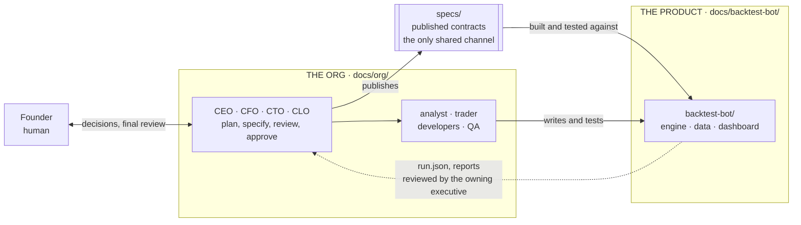

# Documentation

This repository holds **two separate things**, and each has its own documentation set. Read the one you need; they are deliberately not mixed.

| | The **Org** | The **Backtest Bot** |
|---|---|---|
| **What it is** | Bitbull Capital as a company: ten agents, the rooms they work in, the approval gates in front of real money, and the tooling that enforces the boundaries | A deterministic, bar-based backtesting engine and review dashboard for the EMA crossover · BTC · 1h initiative |
| **Its code** | `.claude/`, `CLAUDE.md`, `governance/`, `workspaces/`, `scripts/`, `tests/` | `backtest-bot/` |
| **Its docs** | [`docs/org/`](org/README.md) | [`docs/backtest-bot/`](backtest-bot/README.md) |
| **Audience** | Whoever runs or changes the firm: the founder, the CEO session, anyone adding a role | Whoever builds, reviews or runs the bot |

## How the two relate

The org **produces** the bot: executives write the specifications, the engineering team builds to them, and every result comes back through an executive for review before it reaches the founder. The bot knows nothing about the org. It reads specs and data, and writes run output.

`specs/` is the seam. It is the one folder both sides use, so it stays at the repository root. [`specs/README.md`](../specs/README.md) lists every published spec.

## Where to start

| If you want to… | Read |
|---|---|
| Pick up the orchestrator role in a new session | [`HANDOFF.md`](../HANDOFF.md), then [`docs/org/README.md`](org/README.md) |
| Understand who can do what, and why | [`docs/org/`](org/README.md) — org chart, rooms, approval gates |
| Understand what the bot does and how data moves through it | [`docs/backtest-bot/README.md`](backtest-bot/README.md), then [`data-flow.md`](backtest-bot/data-flow.md) |
| Know what is built and what is not | [`docs/backtest-bot/status-and-roadmap.md`](backtest-bot/status-and-roadmap.md) |
| Run the bot or its tests | [`backtest-bot/README.md`](../backtest-bot/README.md) |

## Conventions used in these docs

- **Diagrams are Mermaid**, embedded in Markdown. They render on GitHub and in most editors, and they diff like text, so they can be reviewed in a pull request.
- **Status markers** in the bot docs are used consistently:

  | Marker | Meaning |
  |---|---|
  | **BUILT** | Implemented in the repository, covered by tests, and reviewed |
  | **BUILT, UNREVIEWED** | Implemented and committed, but **no reviewer has accepted it**. It is in the repository by a decision to commit, not by a decision that it is correct. Its assumptions are not ratified and nothing downstream may depend on them |
  | **PARTIAL** | Some of the requirement is implemented; the doc says exactly which part is not |
  | **BUILT, NOT IN REPO** | Reported as implemented, but the source is not in this repository. *(No component carries this marker as of 2026-09-20 — the data loader, the only one that did, was recovered. Kept in this legend because the failure mode recurs.)* |
  | **SKELETON** | The module exists and raises `NotImplementedError`; it is a placeholder, never a working stub |
  | **NOT STARTED** | Specified but no code exists |

- **Specs are the source of truth.** These docs explain and connect them; they do not replace them. Where a doc and a spec differ, the spec governs and the doc is a bug. Specs are cited by filename and section.
- **Nothing here is a result.** No BTC data exists in the firm, and no backtest has produced a number about a real market. Any figure in these docs is either quoted from a spec with its source, or labelled as an example.
- **Historical records are not rewritten.** `governance/decision-log.md`, `workspaces/*/messages/` and `workspaces/*/work/` are append-only history. They still cite the pre-restructure paths (`src/…`, `docs/workspaces.md`). Read `src/…` as `backtest-bot/src/…` and `docs/<file>.md` as `docs/org/<file>.md`.
