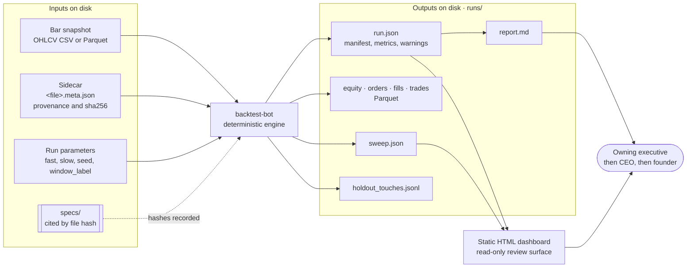
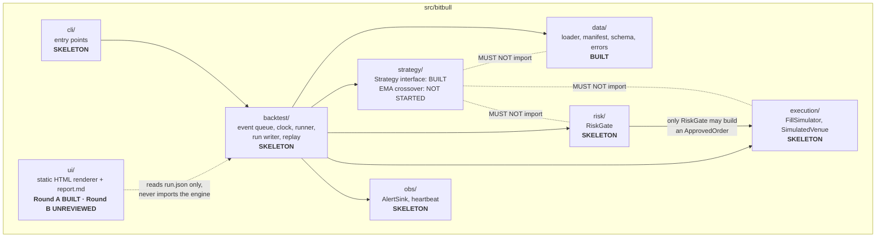
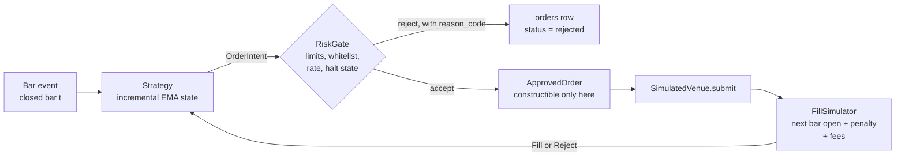

# Architecture

Source of truth: `specs/2026-09-13-backtest-engine-contract-v1.md` (the *engine contract*) and `specs/2026-09-13-run-output-contract-v1.md`. Status markers are defined in [`docs/README.md`](../README.md#conventions-used-in-these-docs).

## 1. System context

The bot is a closed system: it reads two kinds of input from disk, and writes run output to disk. Nothing inside it touches a network, a venue or a credential.

**Trust boundary.** Data enters only through the loader, which refuses anything it cannot fully verify. Output leaves only as files. There is no live venue adapter, no credential read, no HTTP server and no websocket anywhere in this phase (engine contract §15).

## 2. Components and dependencies

| Package | Status | Responsibility | Governing spec |
|---|---|---|---|
| `data/` | **BUILT** | Streaming OHLCV reader; sidecar validation; sha256 verified on every read; every hard refusal is its own exception with a stable `reason_code`; money as `Decimal`; default-deny source classification. Recovered into the repository 2026-09-20 | engine §5; ingestion §2 |
| `backtest/` | **SKELETON** | Event queue with the four-part key, clock, runner wiring intent → gate → venue, atomic run writer, replay | engine §2, §6, §10, §12; run-output §2 |
| `strategy/` | interface **BUILT**; EMA **NOT STARTED** | `Strategy` ABC (`on_event`, `on_fill`, `on_reject`, `on_timer`, `state_hash`). No I/O, no clock, no dataset handle | engine §4; rules §5 |
| `risk/` | **SKELETON** | `RiskGate`: explicit limits with no defaults; the only constructor of `ApprovedOrder`; fail closed | engine §6 |
| `execution/` | **SKELETON** | `FillSimulator`: refuses to construct with any parameter `unset`; `SimulatedVenue.submit` accepts only an `ApprovedOrder` | engine §7; annex |
| `obs/` | **SKELETON** | `AlertSink` (file-based JSONL), heartbeat writer, watchdog | engine §13 |
| `ui/` | Round A **BUILT**; Round B **BUILT, UNREVIEWED** | Pure functions from a parsed `run.json` to HTML and to `report.md`; no metric computation. Round B (F1.5–F1.7, `report.md` renderer) has not been reviewed by the CTO and has two declared gaps — the explorer's JS has never been executed, and no equity-curve chart exists | rules §9; run-output §6 |
| `cli/` | **SKELETON** | Entry points | engine §1 |

A skeleton module *raises `NotImplementedError`* rather than returning a placeholder value, so nothing downstream can mistake an unimplemented path for a working one.

## 3. Design rules that shape the code

These are enforced by tests where marked; the rest are contract requirements the build must meet.

| Rule | Why | Enforced |
|---|---|---|
| `strategy/` may not import `data/`, `execution/` or `risk/` | A strategy that can reach the dataset can look ahead. It receives one event at a time and its own state | Import-graph test — **implemented** (`tests/bitbull/test_import_graph.py`) |
| `ui/` may not import engine packages, and does no arithmetic on metrics | A metric computed in the frontend is a second definition of that metric; the two drift | AST test — **implemented** (`test_ui_boundaries.py`) |
| No float money anywhere in the money path | Float addition is order-dependent; a float P&L is not reproducible | AST test — **implemented**; four of its tests currently fail because the loader is missing from the repo |
| Nothing computed over a whole series at load time | A leak in load-time state sits *upstream* of any queue-level leakage test | Contract §5 — with the engine |
| Order path is `Strategy → OrderIntent → RiskGate → ApprovedOrder → SimulatedVenue`; the gate cannot be bypassed | Bypass becomes a type error, not something a test must notice | Contract §6 — with `risk/` |
| Fail closed everywhere | Unavailable mark, unreadable halt state, unwritable audit log ⇒ refuse | Contract §6.8 — with `risk/` |
| Time is UTC nanoseconds; the engine orders by `available_at_ns`, not `event_time_ns` | Removes a family of look-ahead defects | Contract §2 — with `data/` and `backtest/` |
| No wall clock, no unseeded randomness, no set-iteration on a decision path | Determinism | Contract §4, §10 — with the engine |

## 4. The order path

Everything a strategy wants to do passes one gate. The venue accepts nothing else.

Rejections are first-class rows in the output, never log lines. A run where nothing happened because everything was refused must be visibly that.

## 5. Environment and dependencies

| Item | Value | Note |
|---|---|---|
| Language | Python `>=3.11,<3.12` | Pinned in `backtest-bot/pyproject.toml`; Python 3.12 is refused |
| Runtime dependency | `polars==1.9.0` only | Parquet read and write. `pyarrow` and `numpy` are deliberately **not** dependencies |
| Dev dependency | `pytest==8.3.3` | |
| Locking | `backtest-bot/uv.lock`, installed with `uv sync --frozen` | Adding a dependency needs CTO sign-off |
| UI | Python standard library only | No framework, no external font, no network |
| Packaging | `hatchling`, package `bitbull` from `src/` | |

## 6. Where the bot stops

Absent by design this phase (engine contract §15): live venue adapter, credentials, network access from the engine, database server, HTTP server, websocket, C++/Rust components, latency optimization, multi-venue support. Adding any of them is a new decision, and anything that could place an order enters the org's production-deployment gate — see [`docs/org/approval-gates.md`](../org/approval-gates.md).
