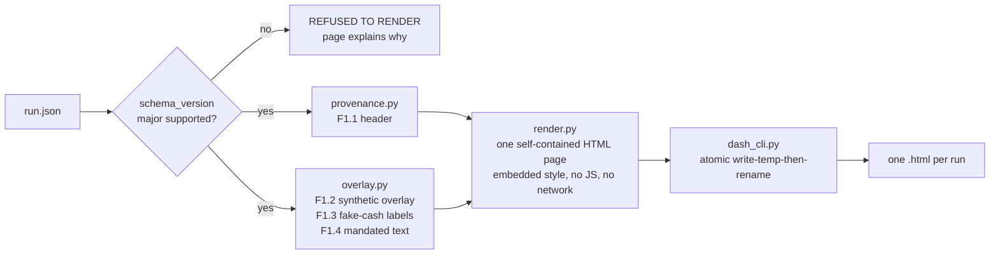
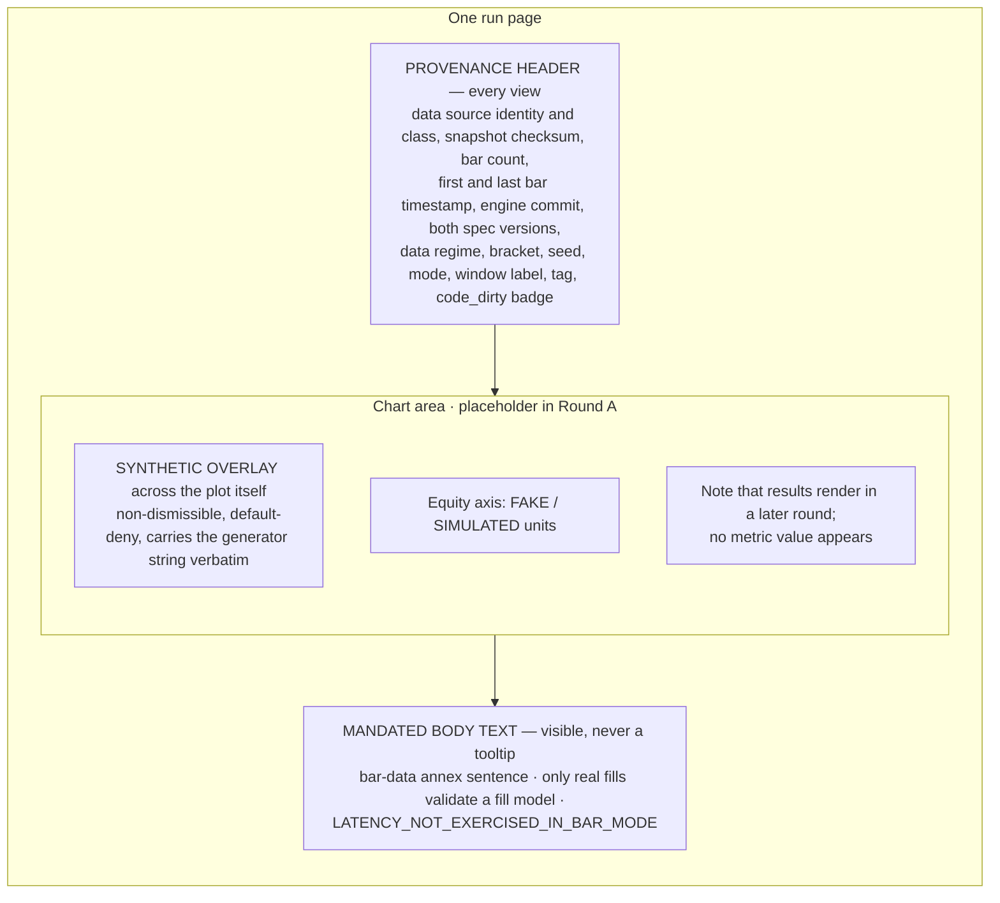
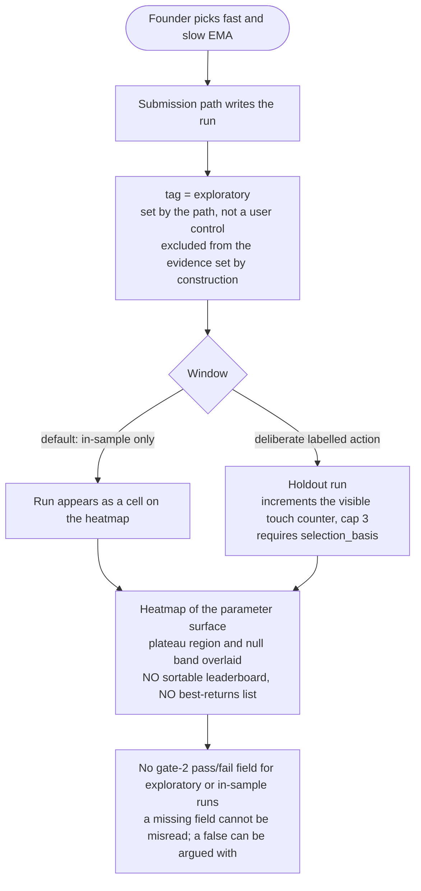

# Dashboard — the Review Surface

The founder asked for a dashboard where they can choose the EMA values. This page describes what exists, what is required, and what the dashboard may **never** do. Sources: rules spec §9 (`ema-crossover-btc-1h-v1`), run-output contract §6, `bar-ingestion-and-run-fields-v1` §3. Code: `backtest-bot/src/bitbull/ui/`.

## 1. Principles

1. **It computes nothing.** A metric computed in the frontend is a second definition of that metric, and the two disagree the week nobody is looking. The dashboard may *format and round* using the declared `unit`, *position marks on axes*, *filter runs by index fields* and *lay out a heatmap from emitted values*. It may **not** aggregate across runs, derive any ratio, difference, percentile, annualization, confidence interval, plateau region or null band, or substitute a value for a missing one. An AST test enforces it.
2. **Provenance before results.** Nobody reads a number before they know what produced it.
3. **Truth in display.** Synthetic, unverified or fake-cash data is unmissable. A missing cost model is a designed view, not an empty panel.
4. **Exception-first.** Quiet when healthy, unmissable when not.

## 2. Architecture



The renderer is **pure functions over a parsed `run.json` dict** using only the standard library. No framework, no font host, no script. A test asserts no `socket`, `urllib`, `http.client`, `requests` or `httpx` import anywhere under `ui/`.

## 3. Page composition (Round A, as built)



| Rule | Implementation |
|---|---|
| Missing versus null | A header field the run does not carry renders **`(not emitted this run)`**; a field present but `null` renders **`n/a`**. Never blank, never a guess |
| Default-deny overlay | Shown **unless** `data_source.class == "venue_verified"` — covers synthetic, third-party, and a run with no `data_source` at all. No dismiss control exists in the DOM |
| Fake cash | `FAKE / SIMULATED` beside every currency figure and axis; no currency symbol without the qualifier |
| Unsupported schema | An unknown `schema_version` major renders a refusal page, not a best guess |
| Dirty tree | A run with `code_dirty: true` is badged "produced from an uncommitted tree" |

## 4. The three states the fixtures exercise

| State | Fixture | What the page shows today |
|---|---|---|
| **running** | `…fixture-running-ab12cd34` | Provenance header; no metrics; no series |
| **cost-refused** — *the normal state until the founder picks a venue* | `…fixture-failed-costmodel-ef56gh78` | Provenance header; the chart area states results are not rendered; **no metric appears anywhere**, so gross can never appear without net |
| **completed** | `…fixture-completed-cd34ef56` | Provenance header and overlay; **no metric renders in Round A** (a test asserts the fixture's gross and net figures never appear on the page) |

## 5. Requirements and build status

| ID | Requirement | Status |
|---|---|---|
| F1.1 | Persistent provenance header on every view | **BUILT** |
| F1.2 | Non-dismissible synthetic overlay across the chart area | **BUILT** (Round A's labelled placeholder box was removed in Round B; the overlay now sits over the results and heatmap areas. **No real chart exists yet** — see F1.6) |
| F1.3 | Fake-cash labelling | **BUILT** — see open question below |
| F1.4 | Mandated body text, including the latency warning | **BUILT** (the cost-model sentence is a labelled *paraphrase* of the CTO's work-order gloss, because the spec's exact §13.2 text was outside that build's reading list) |
| F1.5 | Designed "no cost model → no net result" view listing `unset_parameters` | **BUILT, UNREVIEWED** — `ui/cost_state.py` |
| F1.6 | Results view: gross and net on the same axes at the same scale, both brackets together, break-even `k_bar` and round-trip bps beside any headline, `null` as "n/a" with reason code, the three-part bar attribution | **PARTIAL, UNREVIEWED** — `ui/results.py`. Everything except the visual: **gross and net are adjacent rows in a table, not a chart on shared axes**, and there is **no equity-curve chart at all**. Blocked on a CTO ruling on whether chart geometry is exempt from the no-arithmetic boundary test, and on the `polars` dependency for reading the series Parquet |
| F1.7 | Parameter explorer (below) | **BUILT, UNREVIEWED** — `ui/explorer.py`. **Its inline JavaScript has never been executed** — no browser or Node exists in this environment. Tests cover DOM structure and the no-JS fallback (every value is also in the static table); the show/hide, click and keyboard handlers are unexercised. It cannot launch a new exploratory run — it looks up precomputed cells in `sweep.json`, and nothing yet produces one |
| — | `report.md` renderer (pure function over `run.json`, no engine access) | **BUILT, UNREVIEWED** — `ui/report_md.py`. Open: who calls `write_report_md(run_dir)` at run finish, given the engine must not import `bitbull.ui` |
| — | Alert-digest format | **NOT STARTED** |

**Round B is unreviewed.** F1.5–F1.7 and the `report.md` renderer are in the repository because the founder directed that everything be pushed together; the CTO review is Batch 3 and has not happened. Nothing downstream may treat the field names this code reads (`n`, `ci_low`, `ci_high`, `unset_parameters`, `plateau_mask`, `null_band`) as ratified contract — several come from the hand-authored fixtures only. Build log and the seven open questions for the CTO: `workspaces/engineering/work/2026-09-20-frontend-f15-f17-build-log.md`.

## 6. The parameter explorer (F1.7) — governance of the founder's own search

The founder's ask is to choose EMA values. Free choice on one year of one instrument is the overfitting machine, so the explorer is built to make a spike *look like a spike*.



Binding CFO requirements: annualized figures labelled with the `N` they came from and **suppressed below the minimum sample**; the confidence interval as visible as the headline; tier-2 switches, if exposed, labelled *sensitivity only — not promotable*; the touch counter, its cap and each prior touch's parameters and selection basis visible, **derived from a window label in the run index, never a human tally**; a base-only default view is not permitted.

## 7. Rendering it

```bash
cd backtest-bot
uv run --frozen python -m bitbull.ui.dash_cli tests/fixtures/runs /tmp/dashout
# writes one .html per run directory; open them in a browser
```

## 8. Open questions

Raised by the frontend build rather than guessed, and owned by the CTO:

1. **F1.3 wording.** The rendered pages say "FAKE / SIMULATED" beside axes and figures, and the data-source string contains "simulat…" — but the pages never contain the literal words "fake cash". Accept as satisfying the requirement in substance, or send back? The CEO flagged it without deciding.
2. **First and last *bar* timestamp** has no field in the run contract (only per-series bounds, which describe run activity, not the dataset). Needs a field or a ruling.
3. **`window_label` and `tag`** are absent from all three fixtures, so they render `(not emitted this run)`.
4. **Bar count** is read from the snapshot's `row_count`, not `events_consumed` (which is smaller on a running or aborted run).
5. **`LATENCY_NOT_EXERCISED_IN_BAR_MODE`** is shown unconditionally now; revisit when any latency value renders.
