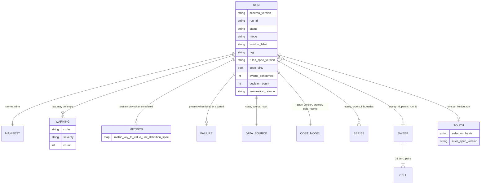

# Data Contracts

Exactly what the bot reads and writes. Sources: `specs/2026-09-13-run-output-contract-v1.md` (run output), `specs/2026-09-13-bar-ingestion-and-run-fields-v1.md` (ingestion, extra fields, sweep, ledger) and `specs/2026-09-13-bar-data-backtest-annex-v1.md` §9 (bar-mode fields). A worked example of every shape is under [`backtest-bot/tests/fixtures/runs/`](../../backtest-bot/tests/fixtures/runs/) — **hand-authored, synthetic, not produced by running any engine.**

## 1. Input: snapshot and sidecar

Two files, both required, no field inferred.

```
open_time, open, high, low, close, volume        required columns, exact names
close_time, trade_count                          optional; any other column is rejected
```

| Sidecar field `<datafile>.meta.json` | Meaning |
|---|---|
| `source_name`, `source_url_or_origin` | Who published it and where it came from |
| `retrieved_at_utc` | RFC 3339 with an explicit `Z` |
| `venue_scope` | One named venue, or `aggregated` plus which venues |
| `symbol`, `quote_currency` | **USD and USDT are different instruments** and must never be mixed in one file |
| `volume_units` | `base` \| `quote` \| `unknown` |
| `timestamp_convention` | `rfc3339_z` \| `epoch_ms` \| `epoch_s` |
| `bar_interval_seconds` | 3600 for hourly |
| `licence_or_terms_ref` | The terms under which we hold it |
| `sha256` | Hash of the data file, verified on every read |

A third-party CSV is **not venue data**: its timestamps, gaps, licence and volume units are unverified even when the file parses cleanly. Hence three source classes — `synthetic_fixture`, `third_party_unverified`, `venue_verified` — resolved default-deny (see [`data-flow.md` §2](data-flow.md#2-ingestion-step-2)).

## 2. Output: one directory per run

```
runs/
  index.jsonl              append-only, one object per run. A CACHE, never the source of truth;
                           fully rebuildable by scanning runs/*/run.json
  alerts.jsonl             append-only AlertSink output
  holdout_touches.jsonl    append-only ledger, one record per holdout run
  <run_id>/
    run.json               manifest + metrics + warnings — the core of the contract
    equity.parquet         one row per equity point
    orders.parquet         one row per intent and its disposition, INCLUDING rejections
    fills.parquet          one row per fill
    trades.parquet         one row per closed round trip
    heartbeat.json         monotonic counter + wall-clock stamp
    report.md              rendered FROM run.json by a function with no engine access
    sweep.json             sweep level only: per-cell metrics, plateau_mask, null_band
```

`run_id` is the directory name and appears inside `run.json`: a UTC timestamp plus a short digest of (code version, snapshot id, parameters, seed) — listing is a directory sort, and an identical re-run is recognizable as identical.

Series and blotters are **Parquet written with `polars`**; `run.json`, `index.jsonl` and `alerts.jsonl` are JSON. `runs/**` is build output: `*.parquet` is gitignored repo-wide, but `run.json` is not, so it can be attached to a decision record. That is a reason to keep raw market data out of it.

## 3. `run.json`



### Envelope

| Field | Rule |
|---|---|
| `schema_version` | `"<major>.<minor>"`, present in **every** emitted file. A reader **refuses an unknown major** rather than rendering fields it may have misunderstood |
| `status` | `running` \| `completed` \| `failed` \| `aborted`. No default, no absence |
| `mode` | `backtest` \| `paper` \| `live`, written explicitly from run #1. Only `backtest` is reachable; `live` exists so output is unambiguous |
| `created_utc`, `finished_utc` | RFC 3339 with `Z`; `finished_utc` is `null` while running |
| `events_consumed`, `decision_count`, `termination_reason` | Required by the leakage and vacuous-pass guards |
| `code_dirty` | First-class boolean, never inferred. A surface must badge a dirty run "produced from an uncommitted tree" |
| `window_label` | `is` \| `holdout` \| `full` \| `fixture`. **Required, no default; the run refuses to start without it.** It makes the touch counter machine-derived |
| `tag` | `evidence` \| `exploratory`. Written by the submission path, not a user control. Every dashboard-initiated run is `exploratory` **by construction** |
| `selection_basis` | `declared_in_advance` \| `is_surface_only` \| `is_surface_plateau_centroid`. **Required when `window_label == holdout`** |
| `rules_spec_version` | e.g. `ema-crossover-btc-1h-v1`. The touch budget is scoped to this value |
| `sweep_id`, `parent_run_id` | Nullable, written from run #1 — once a sweep exists on disk without a shared id there is no way to recover it |

### Manifest (inline — a reader never correlates a second file)

Git commit SHA; dirty flag **and** a hash of the diff; lockfile hash; Python version; platform; snapshot id with per-file sha256 and row counts; canonicalized parameter dict and its hash; RNG algorithm, seed **and draw count at run end**; engine version; cited spec filenames **with file hashes** (citing "v1" proves nothing if v1 was edited in place); risk-limits block and hash; cost and fill model ids and parameters; mode; timezone; counts; fit-window provenance; and the **count of parameter configurations tried against this dataset**, which is reported and never gates. A run **refuses to emit a result without a complete manifest.**

### Metrics — an open map, with citations

```json
"metrics": {
  "net_ann_sharpe": { "value": 0.42, "unit": "ratio", "definition_spec": "<spec file>#<section>", "n": 214, "ci_low": -1.31, "ci_high": 2.09 },
  "net_pnl_total":  { "value": "6021.8800", "unit": "currency", "definition_spec": "<spec file>#<section>" },
  "half_spread_component": { "value": null, "unit": "currency", "reason_code": "NO_QUOTE_DATA_IN_DATASET", "definition_spec": "<spec file>#<section>" }
}
```
*(Values above are from the synthetic fixture and illustrate shape only.)*

- The key set is **open** — a new CFO metric appears in a later surface with no code change.
- `unit` is **required** (`ratio|fraction|bps|currency|count|days|seconds`). `0.12` and `12.0` are indistinguishable without it, and the mistake surfaces as a chart wrong by 100×.
- `value: null` with the entry present means *not computable for this run* and renders "n/a"; an **absent** entry renders as nothing. The two are different facts.
- `definition_spec` is per metric, so a mid-phase redefinition is visible where the number is shown.
- **Metrics for a non-`completed` run are absent, not partial.** A half-run Sharpe is worse than no Sharpe.

### Warnings — a required channel, even when empty

```json
{ "code": "DATA_GAP", "severity": "warn", "message": "...", "count": 1,
  "first_event_time": "...", "last_event_time": "..." }
```

An empty list is valid and meaningful; a missing key is not. `code` is shared with the `AlertSink` vocabulary — one vocabulary, not two.

### Numbers and time

| Rule | Detail |
|---|---|
| Money and quantity in JSON | **Decimal strings**, never JSON floats. In Parquet: scaled int64 with a declared `scale` |
| Currency | An explicit `currency` / `quote_currency` field, never assumed |
| Timestamps | RFC 3339 UTC with `Z`, or int64 nanoseconds in Parquet. Event time (`*_event_time`) and wall clock (`*_utc`) have distinguishable names |
| Join keys | `fills.order_id` ↔ `orders.order_id`; `orders.intent_id`; `trades.fill_ids`; every row carries `event_time` and `seq`. Without these, drilling from an equity point to the causing fill is impossible and cannot be retrofitted |
| Rejections | **Rows, not log lines** — an `orders` row with `status` and a stable `reason_code` |
| `params` | Scalars at the top level, plus a flattened `a.b.c` key for structured parameters, so a sweep table is buildable from the index |
| `run.json` size | Small; contains no raw market data |

## 4. The cost-refused shape

```json
{ "status": "failed",
  "failure": { "stage": "cost_model_construction", "message": "...", "event_time": "..." },
  "unset_parameters": ["bar_fill.sigma_window_bars", "latency.data_latency_ms", "..."],
  "termination_reason": "cost_model_construction_refused",
  "events_consumed": 0 }
```

No `metrics`, no equity series. Fully formed, not a crash. Example: `tests/fixtures/runs/20260913T090500Z-fixture-failed-costmodel-ef56gh78/run.json`.

## 5. `sweep.json` and `holdout_touches.jsonl`

| File | Contents | Hard rule |
|---|---|---|
| `sweep.json` | Per tier-1 cell: `run_id`, metric map, `N`, `tier`. Plus `plateau_mask` (±25% of both spans, rounded to valid grid values) and `null_band` percentiles (≥ 1,000 resamples, seed recorded) | **No rank field. No ordering. No `best` key** |
| `holdout_touches.jsonl` | One record per run with `window_label == holdout`, regardless of `tag`: `run_id`, parameters, `selection_basis`, `rules_spec_version`, timestamp | Append-only. **The 4th touch refuses to start; no override flag exists** |

## 6. Atomicity and integrity

- `run.json` is written **write-temp-then-rename in the same directory**, so a reader sees the previous complete state or the new one, never a partial parse.
- `status: running` is written **at start**, so a crash is a nameable state.
- `index.jsonl` is JSONL, not an array, so a crash mid-write truncates one line; a reader skips unparseable lines and reports how many.
- Snapshot immutability is enforced by **content hash verified on read**, not by file permissions (permission bits were measured not to protect anything as the uid we run as). A mutated snapshot makes the run fail.
- Parquet repeat-writes were measured byte-identical within and across processes, which makes a per-file sha256 a reproducibility check rather than only a corruption check.

## 7. Versioning

| Change | Effect |
|---|---|
| Adding an optional field | Additive; no version bump |
| Changing the ingestion contract, required-field semantics or the touch-ledger rule | `bar-ingestion-and-run-fields` **v2** |
| Changing any cost-model parameter | New `spec_version`; **invalidates every prior result**; two `spec_version`s may never share axes |
| Unknown `schema_version` major | Readers refuse |
