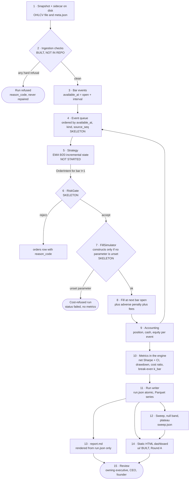
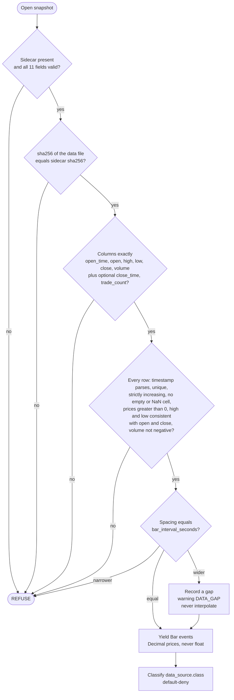
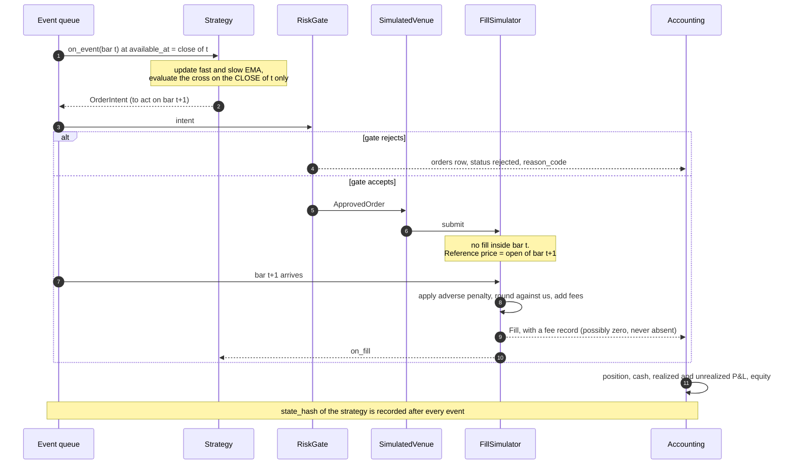
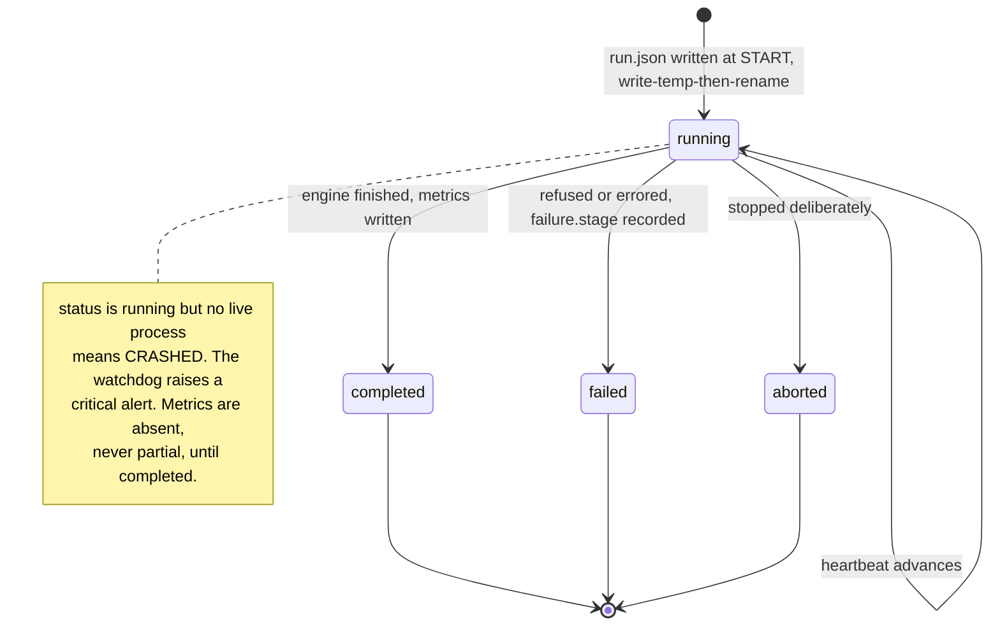
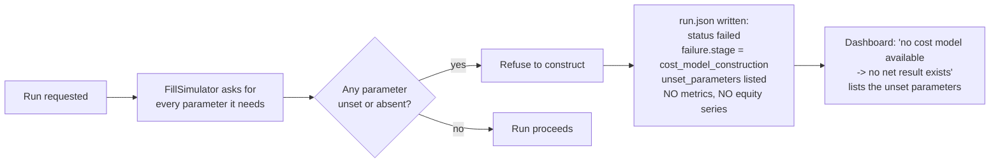
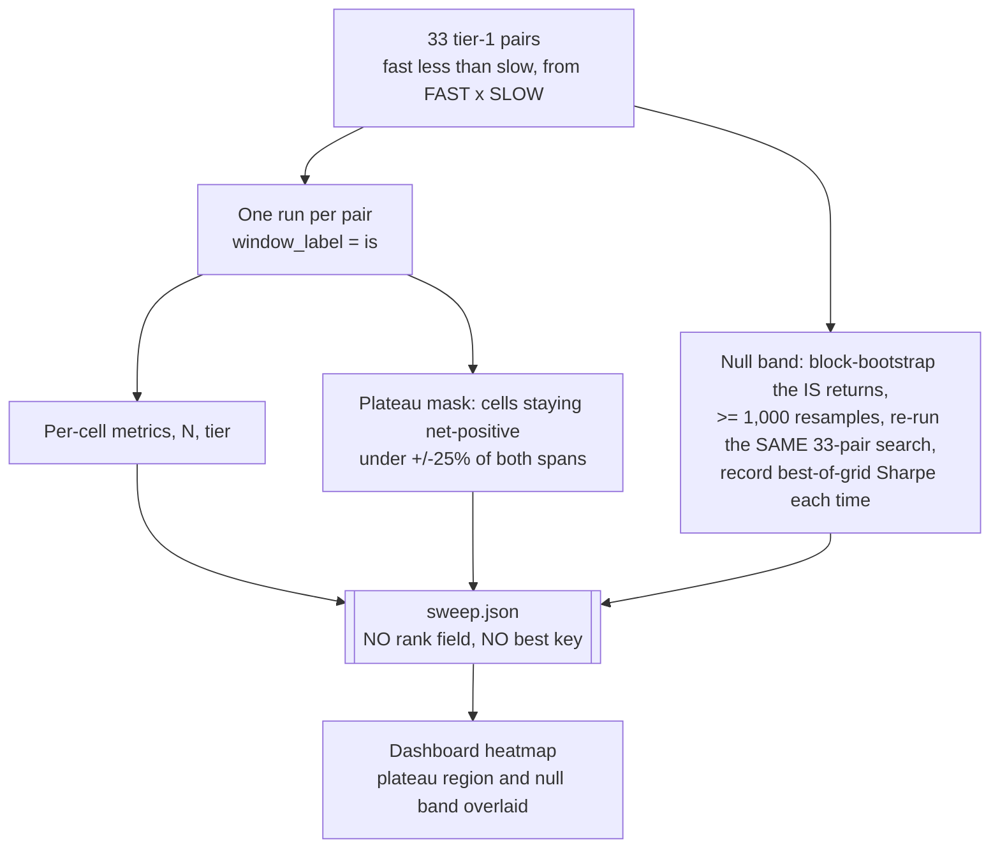
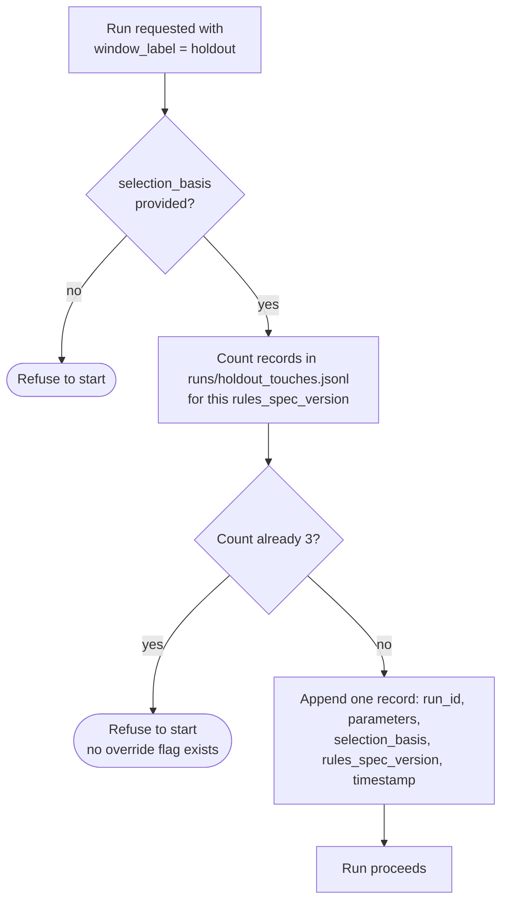
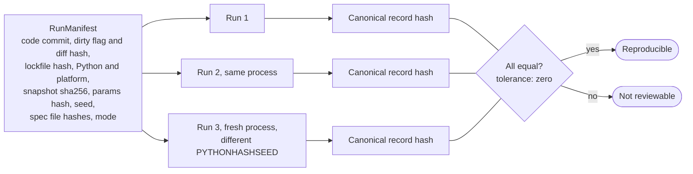

# Data Flow

How a file of hourly bars becomes a reviewed result. Every stage names the spec that governs it and its build status. Status markers: [`docs/README.md`](../README.md#conventions-used-in-these-docs).

## 1. End to end

Three properties of this flow are deliberate:

- **Two ways to stop before a number exists** (steps 2 and 7). Both produce a complete, honest output. Neither produces a partial result.
- **The dashboard and `report.md` read `run.json`, never the engine.** They are structurally unable to show a number the machine-readable record does not contain.
- **Metrics are computed once, in the engine.** The frontend formats and positions; it never aggregates, ranks or derives.

## 2. Ingestion (step 2)

Governing spec: `bar-ingestion-and-run-fields-v1` §2. One data file plus one sidecar; both required; **no field is inferred and none has a default.**

**Source classification is default-deny.** `data_source.class` is one of `synthetic_fixture`, `third_party_unverified`, `venue_verified`. Anything not positively proven `venue_verified` is not `venue_verified`; a missing or unrecognised block resolves to the most cautious class. The loader can never emit `venue_verified` — it is unreachable from its schema.

**A wide gap is not an error and not repaired.** It is recorded, warned, and trading is suppressed for the gap and for `warmup_events` bars after it. The engine has no interpolation path to disable, because none is written.

## 3. Time: one bar, one event

A bar is knowable only when it closes. The whole look-ahead defence rests on this table (engine contract §2).

| Field | Meaning | For an hourly bar opening at 09:00 |
|---|---|---|
| `event_time_ns` | When it happened in the market | the bar's open time, 09:00 |
| `available_at_ns` | The earliest instant we could know it | **10:00** — open + `bar_interval_seconds` |
| `observed_at_ns` | When our pipeline received it (wall clock) | recorded, **excluded** from the determinism hash |

The engine delivers by `available_at_ns`. A bar delivered at its open time is a defect, not a convention. All timestamps are int64 nanoseconds since the Unix epoch, UTC.

## 4. One bar through the engine

Rules visible in this sequence: **no same-bar action**; the signal uses the close of bar *t*, the fill uses bar *t+1*; a stop and a crossover exit on the same bar resolve **stop first**; where an exit and a fresh entry coincide, the exit is processed first and no re-entry is evaluated until the next bar's close.

## 5. Run lifecycle and atomicity

A reader must be able to tell *in progress*, *finished* and *crashed* apart without guessing, and must never read a half-written file (run-output contract §2).

| Status | `metrics` | Series files | Meaning |
|---|---|---|---|
| `running` | absent | absent | In progress — or crashed if no process is alive |
| `completed` | present | present | Finished and verified |
| `failed` | **absent** | **absent** | Stopped with `failure: {stage, message, event_time}`. The cost-refused case is `stage = cost_model_construction` |
| `aborted` | absent | absent | Stopped deliberately |

## 6. The cost-refusal path (step 7)

This is **the normal state today**, because every venue-sourced parameter is `unset`. The dashboard must show it as a designed view, not an empty panel — an empty fee panel reads as zero fees.

No zero fee, no default, no `enabled` flag — anywhere. Gross P&L is never displayed without net beside it, so with no net there is no P&L at all.

## 7. Sweep, null band and plateau (step 12)

The founder's dashboard question — *"which EMA values?"* — is answered by a surface, not a ranking.

`sweep.json` carries **no rank, no ordering and no `best` key.** If the engine emitted a rank, a ranked list would eventually be rendered; the absence is the control. The plateau mask and null band are computed by the engine because the frontend may not derive them.

## 8. The holdout-touch ledger

The holdout may be evaluated **three times, ever**. The count is data, not a human tally.

| Touch | Candidate | Selection basis |
|---|---|---|
| 1 | 9/20, the founder's spec | `declared_in_advance` |
| 2 | Tier-1 in-sample argmax | `is_surface_only` |
| 3 | Plateau centroid, only if touch 2 is a spike | `is_surface_plateau_centroid`, decided on the IS surface *before* touch 2's result |

Refusing is always safe, so enforcing this as a refusal removes no human signature — it only stops an action nobody authorized. A v2 pre-registration receives a fresh budget because the budget is scoped to `rules_spec_version`.

## 9. Reproducibility loop

Wall clock, durations, hostname, paths and memory are recorded but **excluded** from the hash. A dirty working tree does not block a run; it marks the result non-reproducible **in the output itself**, and any surface must badge it "produced from an uncommitted tree".
