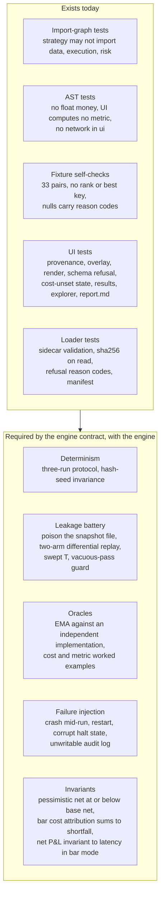

# Engineering Standards

The production practices the bot is built to, which of them are **already enforced by code or tests**, and where the gaps are. Sources: `specs/2026-09-13-backtest-engine-contract-v1.md`, the firm-wide rules in [`CLAUDE.md`](../../CLAUDE.md), `governance/policies/`.

Two kinds of statement appear below and are kept apart:

- **Standard** — already required by a published spec or firm rule.
- **Proposed** — a recommendation from this documentation pass. **Not approved.** Engineering tooling belongs to the CTO (`.github/**`, `Makefile`, build files), and anything that could place an order is gated by the org's production-deployment gate.

## 1. Standards already in force

### Correctness and determinism

| Standard | Detail | Enforced today |
|---|---|---|
| **Deterministic** | Two runs from one manifest produce a byte-identical canonical record; tolerance zero; invariant to `PYTHONHASHSEED`; three-run protocol (twice in-process, once fresh) | With the engine — not yet built |
| **No float money** | Money and quantity are integers in minor units or fixed-scale `Decimal`. Float addition is order-dependent (the same ten values summed in two orders give `0.0` and `0.9999999999999999`) | AST test `test_no_float_money.py` — *four of its tests currently fail; the loader is missing* |
| **Canonical serialization** | UTF-8 JSON, sorted keys, no insignificant whitespace, `Decimal` as string, floats as `float.hex()` | With the engine |
| **No wall clock / unseeded randomness / set iteration** on a decision path | `time.time`, `datetime.now` and friends raise inside `strategy/` | With the engine |
| **No look-ahead** | Bars delivered at their close; nothing computed over a whole series at load; a taint hook asserts `read_seq <= handling_seq` on every read, in every test run | With the engine |
| **No silent fill-forward** | `ffill`, `dropna`, `min_periods=1` banned in `data/` and `strategy/`; a gap is represented as a gap | Loader behaviour tested when the loader is present |
| **Snapshot integrity** | sha256 verified on every read; a mutated snapshot fails the run | Loader |

### Safety

| Standard | Detail |
|---|---|
| **Paper by default** | `Mode` is an enum; unset, empty or unrecognized resolves to `PAPER`. `LIVE` is absent from the code path, not switched off; requesting it raises |
| **Fail closed** | Missing limit, unavailable mark, unreadable halt state, unwritable audit log all refuse. A system that cannot record an order must not place one |
| **Risk limits are code** | `RiskGate` built from an explicit limits block with **no defaults**; no configuration key may disable a check (keys matching `enabled|disable|bypass|skip|dry_?run|force|override|no_?risk` are banned on a risk path); config fuzzing must leave a breaching intent rejected |
| **Unbypassable order path** | `SimulatedVenue.submit` accepts only an `ApprovedOrder`, constructible only by `RiskGate`; an import-graph test asserts nothing else can |
| **No secrets** | No keys, credentials or account numbers in code, config, logs, commits or reports; no credential of any kind is read by a backtest run |
| **No network from the engine** | And no live adapter, HTTP server or websocket this phase |
| **Honest output** | A run refuses to emit a result without a complete manifest; a cost-unset run emits `failed` with no metrics; nulls are never zeros |

### Change control

| Standard | Detail |
|---|---|
| **Pinned dependencies** | Python `>=3.11,<3.12`; `polars==1.9.0`, `pytest==8.3.3`; lockfile committed; installs use `uv sync --frozen`. A new dependency needs CTO sign-off |
| **Specs are versioned by convention *and* by hash** | Every run records the sha256 of each cited spec, because citing "v1" proves nothing if v1 was edited in place. `scripts/spec_lint.py` checks that citations resolve |
| **Published-spec builds only** | Developers build from the published version in `specs/`, cite it in every report, and route ambiguity CTO → CFO → analyst — never guess |
| **Never claim what wasn't run** | A test is not "passing" until executed with real output; a latency or throughput figure is not stated unless measured |
| **Release gate** | QA `PASS` → CTO sign-off → CEO → founder for anything that can place a live order. A dirty tree marks the result non-reproducible in the output |
| **Push gate** | Every push to GitHub: QA verifies from a **fresh clone**, the CTO approves in a signed record, a local pre-push hook checks the record. Checklist: `governance/policies/push-checklist.md` |

## 2. Testing strategy



Principles: QA **owns the synthetic data generator** used for leakage, accounting and risk tests — if the author of the engine also writes the data it is judged on, the data avoids the engine's weak spots. Tests are never weakened, skipped or deleted to reach green. A vacuous pass is a defect: leakage tests assert the pre-T decision stream is non-empty and that event counts match across arms.

## 3. Run it

```bash
cd backtest-bot
uv sync --frozen
uv run --frozen pytest -q
```

Windows: set `PYTHONUTF8=1` if a test reads non-ASCII files.

## 4. Production-readiness gaps

Honest list, measured against this repository on 2026-09-20. None is a blocker for the current phase (no order can be placed); all are cheap before the engine grows.

| # | Gap | Evidence | Proposed remedy | Owner |
|---|---|---|---|---|
| 1 | **No CI.** No `.github/workflows/`; nothing runs the tests on push | `.github/` absent | A workflow running `uv sync --frozen`, the bot tests, `spec_lint.py` and `check_boundaries.py --audit` on every push and pull request. Fail the build on any *new* red beyond the documented known set | CTO |
| 2 | **The data loader is not in the repo** | A bare `data/` line in `.gitignore` ignored `src/bitbull/data/`; six tests fail on a fresh clone | `.gitignore` is now anchored (`/data/`, `/backtest-bot/data/`). **The loader source must still be recovered from the original environment and committed** | CTO / backend |
| 3 | **A fresh-clone check is not part of any process**, which is how gap 2 went unseen — the previous check built a temp clone from `git ls-files` *plus untracked files* | Build log B1.1 | CI (gap 1) gives this for free: it only ever sees committed files | CTO |
| 4 | **No linter, formatter or type checker** configured | `pyproject.toml` has only pytest config | Add `ruff` and a type checker as pinned dev dependencies; `mypy --strict` on `data/` and `risk/` first, where money is handled | CTO |
| 5 | **No test coverage measurement** | — | Add `coverage`; require coverage of the risk-critical paths specifically, not a global percentage | CTO / QA |
| 6 | **No `Makefile` or single entry point** | Reserved to the CTO by the registry; the backend flagged it | One target set: `install`, `test`, `lint`, `render-fixtures` | CTO |
| 7 | **Line endings unpinned.** On Windows, `core.autocrlf` rewrites checked-out files, which changes their bytes — and spec citations are sha256 hashes of file bytes | Git warned "LF will be replaced by CRLF" during this work | Add a `.gitattributes` with `* text=auto eol=lf` (and `*.parquet binary`) so hashes are stable across machines | CTO |
| 8 | **Org tooling reads files without an encoding**, so it fails on Windows without `PYTHONUTF8=1` | `UnicodeDecodeError` in `msg.py` paths | Pass `encoding="utf-8"` everywhere in `scripts/` | CTO |
| 9 | **8 known-red tooling tests** (`tests/test_tooling.py`) | Six: unfinished `msg.py` migration, reverted after QA found it corrupted a work order. Two: `check_boundaries.py --include-ignored` reports a collapsed ignored directory (`backtest-bot/data/`) rather than the file inside it | CTO finishes the migration and fixes the ignored-path listing | CTO |
| 10 | **No dependency or secret scanning** | — | Add secret scanning and a dependency audit to CI; the firm's rule 5 (no secrets in the repo) is currently a convention plus `.gitignore` | CTO |
| 11 | **No `LICENSE` / ownership statement** | `pyproject.toml` says `Proprietary` only | Add a short proprietary-rights notice | CEO / CLO (CLO on hold) |
| 12 | **No branch protection or review requirement** on GitHub | Work is pushed straight to a feature branch. The push gate (QA + CTO record, local hook) covers only clones that install the hook; `--no-verify` and API pushes bypass it | Require a pull request and a passing CI check before merge to the main branch — the only server-side enforcement of the push gate | Founder |

## 5. Definition of done for the bot's first release

A candidate release is ready for the CTO's sign-off only when **all** hold:

1. Every module in [`architecture.md`](architecture.md) is **BUILT** — no `NotImplementedError` on a path a run can reach.
2. The QA catalogue in the engine contract §14 has been **executed**, with real output, ending in `RELEASE VERDICT: PASS` (or an honest `PASS WITH NOTED RISK`).
3. The determinism three-run protocol and the two-arm leakage battery pass.
4. A clean-clone CI run is green, with no new red beyond the documented known set.
5. The dashboard covers F1.1–F1.7 and the `report.md` renderer, with the gross-never-without-net and synthetic-unmissable acceptance criteria tested.
6. The CTO has ruled on the open questions in [`dashboard.md` §8](dashboard.md#8-open-questions) and [`status-and-roadmap.md`](status-and-roadmap.md).

Then: CTO sign-off → CEO approval → founder's final review. **A real-data result additionally needs the two founder decisions** (venue, data) — until then the correct output of a run is *no cost model available → no net result exists*.
