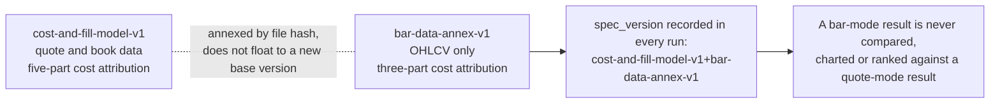
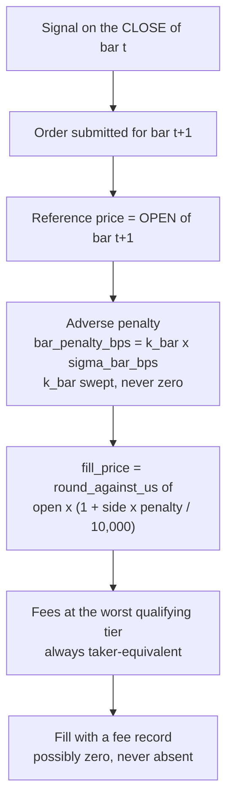

# Execution and Costs

How a simulated order becomes a fill, and what it costs, when the only data is OHLCV bars. Sources: `specs/2026-09-13-cost-and-fill-model-v1.md` (base model, sections cited below) and `specs/2026-09-13-bar-data-backtest-annex-v1.md` (the bar-mode regime). Where this page and a spec differ, the spec governs.

> **The model is not validated, and bar mode makes that worse.** Every execution cost in a bar-mode run is a **proxy over a swept coefficient, not a measurement.** No fill model is validated by a run; only real fills validate a fill model. Each report must say so in visible body text.

## 1. Why there is an annex

The base model (v1) assumes a continuous order book with a mid, spread, depth and a tape. Hourly OHLCV has none of those. Rather than change v1 — which would invalidate every prior result — the **annex** adds a separately named data regime, `bar_ohlcv`, with its own parameters, cost identity and output fields.



Engineering's reading (`bar-ingestion-and-run-fields-v1` §6) is that the additive annex is correct and no v2 is needed; the engine **refuses** a bar-mode run whose cited specs omit the annex's file hash, and refuses a base-version mismatch.

## 2. The fill rule in bar mode



| Ruling | Rule | Why |
|---|---|---|
| 1a Reference | **Next bar's open.** Not `close(t)` (look-ahead), not `close(t+1)` (lets bar `t+1`'s information into a decision made before it began), not `(H+L+C)/3` (a flattering central tendency — banned) | Removes look-ahead without flattering the fill |
| 1b Penalty | `bar_penalty_bps = k_bar × sigma_bar_bps`, where `sigma_bar_bps` is the trailing realized standard deviation of log bar returns, floored at `sigma_floor_bps` | The single parametric execution-cost term in bar mode |
| 1c | **`k_bar = 0` is forbidden** | A run with no execution penalty is a gross result wearing a net label |
| 1d | Exactly **one** parametric cost term; it replaces v1's latency displacement, book walk and residual impact entirely | Two swept coefficients over the same unobservable are unidentifiable and double-count |
| 1e | The penalized price is **not clamped** to the bar's `[low, high]`; when it falls outside, `penalty_outside_bar_range` is emitted | Clamping would cap cost at the best price printed, which flatters us |
| 1f | Every headline is a **curve over the `k_bar` sweep plus the break-even `k_bar`**. A single-point net number is not reportable | The reported object is where edge reaches zero |
| 2 Maker/taker | **Always taker-equivalent** at the worst qualifying tier. No maker rebate, no passive fill, no queue. A strategy needing passive fills is **not runnable** in bar mode — the engine refuses rather than silently converting | Queue position cannot be derived from bars |
| 5 Stops | Trigger `low(t) <= S`, fill `min(S, open(t))` then penalty then rounding. The **worst-case bound at the bar's extreme is also emitted**; if the two bases disagree on any gate outcome the result is `INDETERMINATE_INTRABAR_PATH`, not a pass | Filling every stop at the extreme is punitive on stop-bearing variants only, which biases the grid away from them — a selection distortion introduced by the cost model |
| 6 End of window | Any open position closes at the **final bar's close with full costs**; `terminal_trade_sensitivity` recomputes with it excluded | A backtest may not end holding an unpriced position |

## 3. Cost attribution

Bar mode has its own three-part identity, and it is a required QA invariant. The base model's five-part attribution is **not** emitted in bar mode — three of its five inputs (mid, far touch at decision, far touch at arrival) would be invented.

```
bar_implementation_shortfall(f) = side * (fill_price(f) - close(t_signal)) * fill_qty(f)

  = bar_reference_component  = side * (open(t+1)      - close(t_signal)) * qty    market movement, NOT a cost
  + bar_penalty_component    = side * (unrounded_fill - open(t+1))       * qty
  + tick_rounding_component  = side * (fill_price     - unrounded_fill)  * qty

REQUIRED INVARIANT: abs(sum_of_three - shortfall) <= 1e-9 * max(1.0, abs(shortfall))
```

`bar_reference_component` is the gap between the signal bar's close and the next open. It is market movement, not a cost, and can be favourable; the other two never can.

**Nulls are never zeros.** Fields that cannot be computed on bars are emitted as `value: null` with a reason code, and rendered "n/a" with that code:

| Field | Reason code |
|---|---|
| `half_spread_component` | `NO_QUOTE_DATA_IN_DATASET` |
| `latency_component` | `NO_QUOTE_DATA_IN_DATASET` |
| `book_walk_component`, `residual_impact_component` | `NO_DEPTH_IN_DATASET` |
| `spread_proxy_bps` | `SPREAD_PROXY_NOT_IMPLEMENTED` (tagged `PROXY_NOT_MEASURED_SPREAD`, never added to cost) |
| `capacity_estimate` | `NOT_ESTIMABLE_FROM_BAR_DATA` |

## 4. Brackets

Every headline is reported under both brackets, together, by default. The pessimistic bracket is the **same model under a defined transform**, so no second code path exists and the two cannot drift.

| | Base | Pessimistic |
|---|---|---|
| `k_bar` | lowest **non-zero** member of the sweep | highest member of the sweep |
| `alpha_bar` | 0.5 (literature prior, labelled) | 1.0 |
| `bar_participation_cap` | `p` | `p / 2` |
| `sigma_floor_bps` | `v` | `>= v` |
| fees, no-trade | per v1 §12 | per v1 §12, unchanged |

**Required invariant (a QA test):** for any strategy and any window, pessimistic net P&L ≤ base net P&L. If it is ever greater, the bracket logic has a sign error.

## 5. What is still `unset`

The engine **refuses to construct and refuses to start** if any parameter it needs is `unset` or absent. No defaults. No `enabled` flag.

| Parameter | Owner | Blocks |
|---|---|---|
| Every venue-sourced parameter in `cost-and-fill-model-v1` §2 (fees, tiers, tick sizes …) | Founder's **venue decision**, then CFO | Any net number on any data. Both executives recommend **Coinbase first, Topstep second** — the founder decides |
| `bar_fill.sigma_window_bars` | CFO with the analyst | Net numbers in bar mode |
| `bar_fill.sigma_floor_bps` | CFO with the analyst | Net numbers in bar mode |
| `bar_fill.participation.bar_participation_cap` | CFO | Volume-scaled penalty |
| `bar_fill.spread_proxy.estimator` and `.citation` | CFO — must be a cited published estimator implemented from the retrieved paper, never from recall | Informational field only; never gates construction |
| `latency.latency_basis`, `data_latency_ms`, `submit_latency_ms`, `cancel_latency_ms` | CTO and CFO jointly | Zero or unset latency is refused. Today the only available basis is `declared_bound_unmeasured` |

Filling any `unset` produces a **new version** and invalidates every prior bar-mode result. That is correct and currently free: no result exists.

`bar_fill.participation.volume_units_verified` is `false`. While it is `false` the penalty is **size-independent**, no volume cap applies, and the manifest records `assumed_size_regime: "infinitesimal_relative_to_unobserved_depth"` — which is exactly why a bar-mode result carries **no capacity information** and may never be cited for a size, capacity or capital-allocation decision.

## 6. Latency in bar mode

Any plausible latency is far inside one bar and is absorbed into next-bar-open plus penalty, so **latency has no effect on the modelled fill price.** Every bar-mode run carries the warning `LATENCY_NOT_EXERCISED_IN_BAR_MODE`, and no latency sensitivity curve is emitted — a flat line across a swept axis looks like a finding and is an artifact of the regime. The control that justifies carrying an unmeasured latency value is a required invariance test: **net P&L must be bit-identical across a range of latency values.**

## 7. One code path

Backtest and paper share the same `FillSimulator` and `CostModel`, constructed from one published spec version, with no `if mode == …` anywhere in the cost or fill path (`cost-and-fill-model-v1` §13). This makes backtest-versus-paper divergence a real signal about plumbing — and makes their *agreement* a tautology about the model. Paper is out of scope for this phase.
