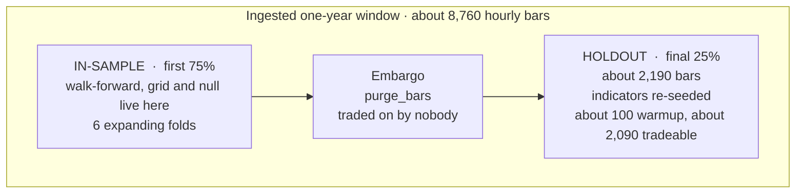
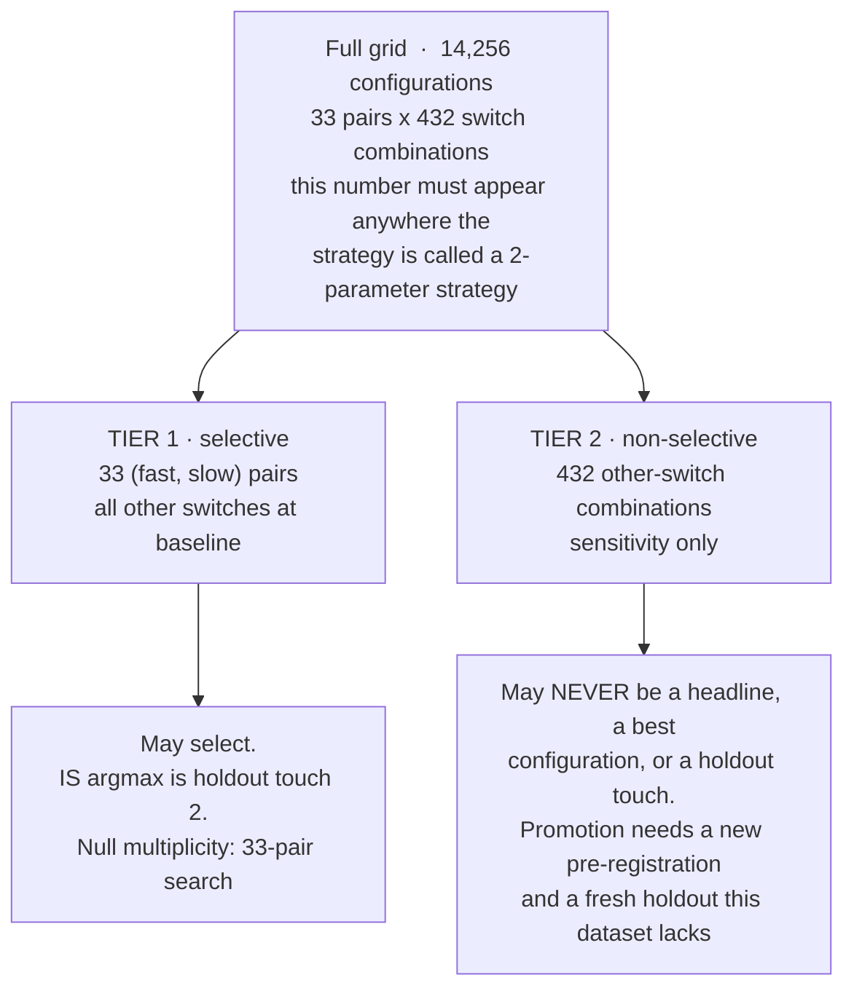

# Methodology — How the Strategy Is Tested Honestly

Source of truth: `specs/2026-09-13-ema-crossover-btc-1h-rules-and-dashboard-v1.md` (the *rules spec*, token `ema-crossover-btc-1h-v1`), as amended by the CFO's review (amendments C1–C8). Where this page and the spec differ, the spec governs.

## 1. Read this first: what the evidence can and cannot show

- **No BTC data exists in the firm.** Nothing below has been computed. Nothing here is a performance claim about BTC.
- **The holdout cannot measure a Sharpe of 1.5.** On ~2,090 tradeable holdout bars, the standard error of an annualized Sharpe estimate is **~2.05** (closed-form approximation, Lo 2002, iid case, 8,760 hourly bars per year; labelled an approximation and a *floor*, because autocorrelation inflates it). A measured 1.5 carries a 95% interval of roughly **[−2.5, +5.5]**.
- **One year of 1h data on one instrument cannot produce a statistically significant edge claim.** It can produce a validated pipeline, a reproducible protocol, a dashboard, and a defensible **"no edge found"** — which is a valid deliverable and is filed as such.
- **Searching a grid on noise finds "edges".** A *synthetic* Monte Carlo in the spec (150 paths of 6,570 iid Gaussian bars, 33-pair search, zero costs — **synthetic, non-evidential for BTC**) found that **23.3% of pure-noise paths cleared an annualized Sharpe of 1.5**. That is why an in-sample "best pair" means nothing without both an untouched holdout and the null comparison.

Anyone who reports a headline Sharpe from this dataset without its interval is misleading the founder.

## 2. Hypothesis and falsification (fixed before any bar is read)

**Mechanism.** BTC trades continuously with a material share of leveraged and discretionary flow. After a break of a recent range, forced deleveraging and trend-chasing add same-direction flow for longer than a random walk would, producing short-horizon return autocorrelation. A fast/slow EMA cross is a lagging but simple detector of that change. It is a price-and-microstructure claim, not a probability mis-estimate. The CFO's note: this is a heavily crowded rule, accepted as a thesis worth **falsifying cheaply**, not one the firm believes.

**Abandoned for this venue and horizon if either:**
- (a) the founder's 9/20 pair's out-of-sample net annualized Sharpe (base bracket) is ≤ 0; or
- (b) the tier-1 best-of-grid in-sample statistic does not exceed the 95th percentile of the matched-multiplicity null.

Either result is filed as "no edge found" and **is not re-tried with a larger grid.**

## 3. Data split

The split is a mechanical function of the snapshot's own timestamps, so no discretion enters after the data lands.



| Rule | Detail |
|---|---|
| `purge_bars(config)` | `max(SLOW, every other indicator or sizing lookback, trailing-stop depth) + 1`, floored at **100**. Applied at **every** walk-forward fold boundary and at the IS/holdout boundary |
| Holdout re-seeding (C5) | The holdout run re-seeds its indicators from the first bars of the holdout and does not trade during its own warmup. Carrying EMA state across the embargo would mean the indicator has read the purged bars and the embargo purges nothing |
| Walk-forward | Inside IS only: 6 folds, expanding window, 6 contiguous equal non-overlapping test segments, `purge_bars` removed from the end of each train fold |
| Metric of record | **OOS net annualized Sharpe, base bracket**, net of the cost model. The single number that ranks candidates. Everything else is diagnostic |

## 4. The grid: two tiers, and only one may select



```
FAST = {5, 8, 9, 12, 20}        SLOW = {15, 20, 26, 30, 40, 55, 100}
valid pairs: fast < slow, strictly  ->  33 pairs
Other switches: stop type (3) x time stop (3) x confirmation (2) x trend filter (3)
                x sizing (2) x re-entry (2) x EMA seeding (2)  =  432
Tier-1 baseline: no stop, no time stop, no confirmation, no trend filter,
                 fixed-fractional sizing, always-in-market crossover-reverse, SMA seed
```

Session filter: declared **not applicable** (0 degrees of freedom) — BTC spot is continuous. Excluded explicitly, not silently.

## 5. Strategy rules

| # | Rule |
|---|---|
| 1 Signal | `EMA_t = alpha * close_t + (1 - alpha) * EMA_{t-1}`, `alpha = 2 / (N + 1)`. **SMA-seeded**: `EMA_{N-1} = mean(close_0 … close_{N-1})`, first valid at index `N-1`. First-price seeding is rejected: it manufactures spurious early crossovers. No signal is valid before bar index `SLOW-1` |
| 2 Bar-close discipline | The cross is evaluated **only on the close of a fully closed bar `t`**; the order is for bar `t+1`. No same-bar action |
| 3 Sides | **Long-only.** Long when fast > slow, flat otherwise. Long/short is design-only and **not runnable** (no margin or perp product verified on a mandated venue; funding block `unset`) |
| 4 Exit | Crossover-reverse. Exit processed before a coincident re-entry; a stop beats a crossover exit |
| 5 Stops | Fixed `entry * (1 - stop_pct)` or trailing; stop-market. Trigger `low(t) <= S`; fill basis `min(S, open(t))`, then penalty, then rounding against us |
| 6 Sizing | Fixed-fractional **25% of simulated equity**, gross exposure cap 25%, no leverage, no pyramiding. A *declared backtest convention*, not an authorized limit |
| 7 Pathologies | EMAs equal: no event. Flat bar: EMA updates, no ambiguity. Missing bar or gap: **no-trade** for the gap and `warmup_events` bars after — never interpolate. Duplicate timestamp: rejected |
| 8 End of window | Open positions closed at the final bar's close **with full modelled costs**; terminal-trade sensitivity emitted |
| 9 Capacity | **Not estimable from bar data.** A flat declaration, never a number. A standing block on any promotion toward live size |

## 6. The null distribution

Block-bootstrap (or sign-shuffle) the in-sample bar returns, with block length about the median holding period implied by the grid's slow spans, preserving autocorrelation and volatility clustering. On each of **≥ 1,000 resamples**, re-run the **identical** tier-1 33-pair search and record the best-of-grid net Sharpe. Report the real tier-1 best-of-grid as a **percentile of that distribution**. Below the 95th percentile is inside the bulk: **no finding.**

## 7. Holdout budget: three touches, ever

The holdout is the only untouched evidence, so it is rationed and logged (mechanism: [`data-flow.md` §8](data-flow.md#8-the-holdout-touch-ledger)).

| # | Candidate | Selection basis (required field) |
|---|---|---|
| 1 | 9/20, the founder's spec | declared in advance |
| 2 | Tier-1 IS argmax | IS surface only |
| 3 | Tier-1 plateau centroid, only if #2 is a spike | IS surface only — the spike/plateau call is made on the IS surface before and independently of touch 2's result |

**A fourth touch is terminal for this initiative.** If a holdout result triggers the decision to spend touch 3, the holdout has entered the selection loop and the third touch is worthless — hence the required selection-basis field.

## 8. Metrics

Computed **in the engine**, read from `run.json`. The dashboard computes nothing.

| Metric | Definition |
|---|---|
| `net_ann_sharpe` | `(mean(r) / stdev(r)) * sqrt(8760)`, `r` = per-bar net returns. Reported as point estimate + N + CI from a stationary block bootstrap (2,000 resamples, seed recorded). **Emitted as `null` with a warning when trade count < 200** |
| `max_drawdown` | `min_t( equity_t / max(equity_0..t) - 1 )` on the **halt-adjusted** equity curve |
| `cost_ratio` | `net_pnl_total / gross_pnl_total` (gate 3: ≥ 0.30) |
| `exposure` | bars with a non-flat position ÷ total bars |
| `turnover` | `sum(abs(trade notional)) / mean(equity)`, annualized by coverage |
| `trade_count` | closed round-trip trades |
| bar-mode extras | `break_even_k_bar`, `break_even_round_trip_bps`, `penalty_outside_bar_range`, `assumed_size_regime`, `capacity_estimate` (always null), `worst_case_stop_fill_price`, `terminal_trade_sensitivity`, and the three-component cost attribution |

## 9. Gates

| Gate | Bar |
|---|---|
| 0 Pre-registration | Filed before any bar is read. **Met** (analyst's note, 2026-09-13) |
| 1 Sample size | ≥ 200 independent OOS trades to be discussable; ≥ 500 before any promote-to-live conversation. On ~2,090 bars, 200 round trips needs a mean cycle ≤ 10.5 bars and 500 needs ≤ 4.2 — so **gates 1 and 3 pull against each other and neither may be assumed to pass** |
| 2 Net Sharpe | OOS net Sharpe ≥ 1.5 base **and** ≥ 0.75 pessimistic; the base-bracket bootstrap CI lower bound must exceed 0. **Applicable ONLY to a single pre-declared candidate on the untouched holdout. VOID for any in-sample, best-of-grid or dashboard-exploratory number** — the engine emits *no gate-2 field at all* for them |
| 3 Cost ratio | OOS net P&L ≥ 30% of gross |
| 4 Walk-forward | ≥ 60% of the 6 folds net-positive; no fold > 40% of total net P&L; `purge_bars` at every boundary |
| 5 Plateau | Net-positive under ±25% perturbation of both spans and every continuous parameter. **The surface is reported, never the argmax** |
| 6 Drawdown | Re-run with halts active (2%/day, 6% strategy drawdown — **draft** policy recommendations). If halts change the result, the halted result is the reported result |
| 7 Multiple testing | Grid cardinality 14,256 reported; selective count 33; touches capped at 3 with a selection-basis field |
| 8 Reproducibility | Bit-identical re-run from the manifest |
| 9 Paper consistency | Not applicable at this stage |
| R8 veto | Break-even round-trip cost in bps beside every headline; if below 2× the venue's worst-tier taker fee, research stops at this horizon. **Unevaluable today — every venue fee is `unset`** |

## 10. Decision rule: 9/20 versus an alternative

The founder's 9/20 is a **baseline, not a target to beat.** Promote a candidate `x` over 9/20 only if **all** hold:

1. `S_base(x) >= S_base(9/20) + 0.5` and `S_pess(x) >= S_pess(9/20) + 0.5` — a floor, not the test.
2. A **paired** stationary block bootstrap of `D = S(x) − S(9/20)` — the *same* resample indices applied to both candidates' per-bar net returns, 2,000 resamples, seed recorded — has a 90% CI lower bound on `D` above 0 under **both** brackets.
3. `BE(x) >= BE(9/20)` — `x` may not win by trading a thinner cost margin.
4. `x` is a **tier-1** candidate whose in-sample best-of-grid exceeds the 95th percentile of the null.
5. `x` clears gates 5 and 4 independently.
6. `x`'s OOS trade count ≥ 200; below that, no comparison is made at all.

Otherwise the answer is **"9/20, as the founder specified"** — a valid and, on this window, likely outcome. The paired test is used because both candidates trade the same bars, so the dominant variance (the path BTC took) is common and cancels; it consumes no extra holdout touch.

## 11. Amendment

Any change to the grid, split rule, fold geometry, metric of record, decision rule, gate thresholds or touch budget produces **v2** — a new, separately timestamped pre-registration. A grid expanded after a negative result is not an amendment; it is a new hypothesis with no holdout to test it on. Clarifications route **CTO → CFO → market-analyst**, and back. Review date: **2026-10-13**, or on arrival of a verified BTC dataset, whichever is sooner.
