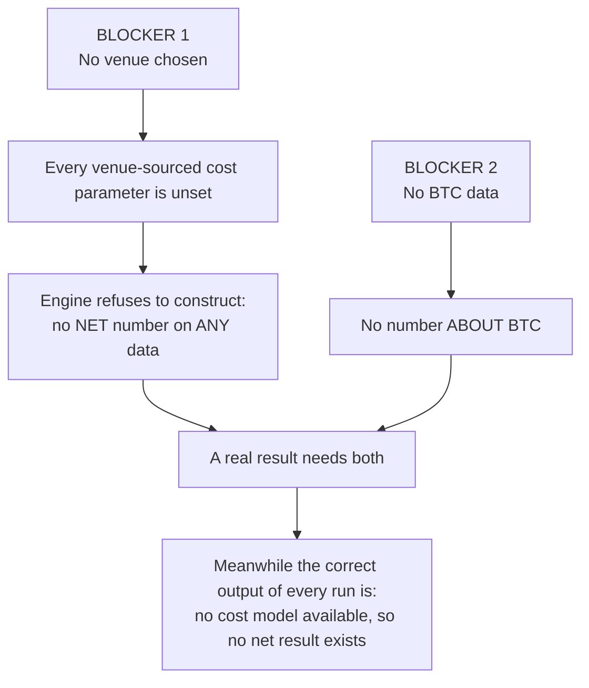
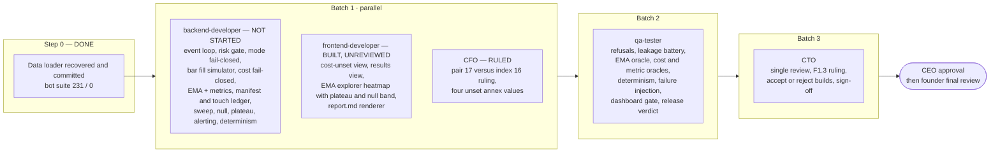

# Status and Roadmap

Last measured **2026-09-20**, in the working tree, after the data loader was recovered and the frontend's Round B landed. Nothing here is remembered from earlier sessions; where a claim comes from the handoff instead of a measurement, it says so. Every number below is re-measured at each push round — QA re-verifies them from a fresh clone, which is the only figure that proves what is actually in the repository.

## 1. Component status

| Component | Path | Status | Evidence |
|---|---|---|---|
| Data loader | `src/bitbull/data/` | **BUILT** | 795 lines measured (`wc -l`, excluding `__pycache__`): `errors`, `schema`, `manifest`, `bar`, `_timestamps`, `loader`, `adjustment`, plus 521 lines of tests. **Recovered 2026-09-20** from remote branch `recovery/data-loader` @ `9d2ccc8` and re-homed under `backtest-bot/`. The six tests that used to fail for its absence now pass. See §3, issue 1 |
| Dashboard Round A | `src/bitbull/ui/` | **BUILT** | F1.1–F1.4, reviewed |
| Dashboard Round B — F1.5, F1.6, F1.7, `report.md` renderer | `src/bitbull/ui/` | **BUILT, UNREVIEWED** | `cost_state.py`, `results.py`, `explorer.py`, `report_md.py`, `format.py`, `freshness.py`; `render.py`/`dash_cli.py` rewritten. `ui/` is now 2,420 lines measured. **The CTO has not reviewed it**, and it carries two declared gaps — see §3, issues 8 and 9. Build log: `workspaces/engineering/work/2026-09-20-frontend-f15-f17-build-log.md` |
| Strategy interface | `src/bitbull/strategy/base.py` | **BUILT** | The `Strategy` ABC. **No EMA computation exists** |
| Fixtures | `tests/fixtures/runs/` | **BUILT** | Three `run.json` (running, completed, cost-refused), `sweep.json`, Parquet series. **Hand-authored and synthetic — not produced by an engine** |
| Backtest engine | `src/bitbull/backtest/` | **SKELETON** | Modules raise `NotImplementedError`; no event loop |
| Risk gate | `src/bitbull/risk/` | **SKELETON** | |
| Fill simulator | `src/bitbull/execution/` | **SKELETON** | |
| Observability | `src/bitbull/obs/` | **SKELETON** | |
| CLI | `src/bitbull/cli/` | **SKELETON** | |
| Equity-curve chart, gross-vs-net bar visual | — | **NOT STARTED** | Blocked on a CTO ruling — §3, issue 9 |
| Sweep, null band, plateau, holdout ledger — the **engine** side | — | **NOT STARTED** | The dashboard renders these from a `sweep.json` artifact; nothing computes one |
| Alert digest format | — | **NOT STARTED** | Engine contract §7 |

## 2. Test status (measured)

Measured 2026-09-20 in the working tree with `PYTHONUTF8=1` on Windows / Python 3.11.15 via `uv`, after the loader recovery and the Round B frontend. **These are working-tree figures; the fresh-clone re-verification is QA's, in the push-approval record for the commit under review.**

| Suite | Command | Passed | Failed | The failures |
|---|---|---|---|---|
| Bot | `cd backtest-bot && uv run --frozen pytest -q` | 231 | 0 | — |
| Org tooling | `python -m pytest tests/test_tooling.py -q` | 43 | 8 | Six are the unfinished `msg.py` work per the handoff (4 frontmatter-parsing, 2 message-creation). **Two are a separate defect found while checking:** the boundary audit's `--include-ignored` reports a collapsed directory instead of the file inside it (observed output), so the two ignored-path tests fail. Known; expected; **no new failures** |
| Push gate | `python -m pytest tests/test_push_gate.py -q` | 63 | 0 | — (33 tests at first; 18 regression tests after QA's first verification found three holes in the gate; 12 more after the CTO's review found five: replace-refs, add-then-remove across commits, merges, submodule-ignore, quoted keys, non-ASCII record names, unsafe path components) |
| **Total** | | **337** | **8** | |

**The known-red set is now 8, all in org tooling.** The six bot failures that used to be on this list were the missing data loader; recovering it removed them, so they are removed from the list as the push checklist requires. The bot suite went from 55 passing to 231 — the loader's own tests (`tests/bitbull/data/`) and the Round B UI tests arrived with their code.

The handoff originally reported "148 passed, 8 failed". That never reproduced from a fresh clone, because the check that produced it ran in a working tree that still contained the loader and its tests. That is the whole reason the push checklist insists on a fresh clone.

Also run and clean at the last verification: `scripts/spec_lint.py` (7 specs, all citations resolve), `scripts/check_boundaries.py --audit`, and a render of all three fixture runs to HTML.

## 3. Known issues

| # | Issue | Impact | Action |
|---|---|---|---|
| 1 | ~~**The data loader was never committed.**~~ **RESOLVED 2026-09-20.** A bare `data/` rule in `.gitignore` matched `src/bitbull/data/` at any depth; the previous "fresh clone" check used `git ls-files` *plus untracked files*, so it never saw the omission | Was: the engine's foundation missing from GitHub, 6 tests red | `.gitignore` anchored; loader recovered from remote branch `recovery/data-loader` @ `9d2ccc8` and committed. Bot suite now 231 / 0. **Residual:** the `recovery/data-loader` branch is redundant on the remote — deleting it is a founder decision, not a build-round side effect |
| 2 | **8 red tooling tests** (6 `msg.py`, 2 ignored-path listing) | Org tooling defects, not bot defects | CTO finishes the `msg.py` migration and makes the ignored-path audit list files rather than collapsed directories |
| 3 | **`(9, 20)` is "pair #17" in the rules spec but index 16 under lexicographic enumeration** | Decides *which configuration is the founder's baseline of record* | **CFO has ruled** — `workspaces/finance/work/2026-09-20-cfo-batch1-rulings.md`. The directed amendments are **not yet applied**, and land as versioned specs (`ema-crossover-btc-1h-v1.1`), never as in-place edits. The dashboard hard-codes no ordinal: it reads `is_founders_declared_pair` from the artifact |
| 4 | **F1.3 wording** — the pages never contain "fake cash" | Accept-or-send-back on a CFO-owned requirement | CTO decision at review — still open |
| 5 | **Annex or cost-model v2?** Engineering's reading is that the additive annex is correct; the annex itself left the question open to the CTO | Determines versioning | CFO to confirm engineering's reading |
| 6 | **Dashboard field gaps** — no first/last bar timestamp field; `window_label` and `tag` absent from fixtures | Header fields render "(not emitted this run)" | CTO ruling, then backend adds fields. The frontend added three more of the same kind: no `ci_level` on `run.json`, `gate_2_pass: null` emitted on sweep cells against contract C2b, and no heartbeat staleness threshold specified anywhere |
| 7 | **No CI, linter, type checker or coverage** | Regressions are found late | See [`engineering-standards.md` §4](engineering-standards.md#4-production-readiness-gaps) |
| 8 | **The explorer's inline JavaScript has never been executed.** No browser or Node exists in this environment; the tests check DOM structure and the no-JS fallback, but the show/hide, click and keyboard handlers are unexercised | The founder's own parameter-picking surface is unproven in the medium it runs in | QA with a browser. Until then the page's interactive behaviour is **unverified**, not working |
| 9 | **No equity-curve chart, and no gross-vs-net bar visual.** Both were specified; neither is built | The rules spec asks for gross and net "on the same axes at the same scale"; they are currently adjacent rows in a table | Needs a **CTO ruling on whether chart geometry is exempt from the no-arithmetic boundary test**, and a decision on the `polars` dependency for reading the series Parquet |
| 10 | **Round B of the dashboard is unreviewed.** It is in the repository because the founder chose to push everything together, not because it passed a review | Nothing downstream may treat its field assumptions as ratified | CTO review — Batch 3 |

## 4. Blockers that no amount of building clears

Both are **founder decisions**. Neither stops the build; both stop the result.

| Blocker | Options for the founder | Recommendation on record |
|---|---|---|
| **Venue** | Choose one of Topstep, Webull, Coinbase, Polymarket | CEO and CFO both recommend **Coinbase first, Topstep second** (open documented API, free history, 24/7). The founder decides. Polymarket is out of scope for the v1 cost model |
| **Data** | (1) Name a public GitHub repo and path holding BTC 1h OHLCV — transport verified; (2) widen the environment's network policy to a venue or Yahoo; (3) upload a CSV or Parquet | Option 2 is the only one that meets the CFO's point-in-time data bar. A third-party CSV is **not venue data** and may be used for a first run only if labelled *unvalidated third-party* |

A third, softer dependency: the CFO owes four `unset` annex values — `sigma_window_bars`, `sigma_floor_bps`, `bar_participation_cap`, and the spread estimator.

**And one finding the founder must not lose:** one year of 1h data on one instrument cannot produce a statistically significant edge claim (Sharpe standard error about 2.05). See [`methodology.md` §1](methodology.md#1-read-this-first-what-the-evidence-can-and-cannot-show).

## 5. Roadmap — the approved plan

Compiled from `HANDOFF.md` §8. Five dispatches in three batches; paths are disjoint, so batch 1 runs in parallel. **Push after every batch.** Step 0 and two thirds of Batch 1 are complete — see the status column in the table below.

| Batch | Owner | Scope | Builds against | Status |
|---|---|---|---|---|
| **0** | backend / CTO | Recover the loader; anchor `.gitignore`; green bot suite on a clean clone | — | **DONE** 2026-09-20 |
| **1a** | `backend-developer` | B1.5–B1.12: event loop · risk gate (shared with paper) · mode fail-closed · bar fill simulator · cost fail-closed · **EMA computation + metrics** · manifest and touch ledger · sweep/null/plateau · alerting · determinism | Engine contract, annex, ingestion spec, rules spec | **NOT STARTED** — was blocked on the loader; no longer is |
| **1b** | `frontend-developer` | F1.5–F1.7: cost-unset state · results view · **EMA explorer with heatmap, plateau region and null band** (the founder's actual ask) · `report.md` renderer with no engine access | Rules spec §9, run-output contract | **BUILT, UNREVIEWED** — gaps in §3, issues 8–10 |
| **1c** | `cfo` | Two rulings that gate correctness: the `(9,20)` index; the four `unset` annex values | — | **RULED**; amendments not yet applied to `specs/` |
| **2** | `qa-tester` | P1–P6 in one dispatch, ending in a release verdict | Engine contract §14 | Not started. **Add: exercise the explorer's JS in a real browser** |
| **3** | `cto` | Review of everything; F1.3 wording; chart-geometry ruling; accept or reject; sign-off | — | Not started |
| **4** | CEO → founder | Approval, then final review of the finished system | — | Not started |

Binding CFO requirements on the frontend: **no best-returns leaderboard**; the confidence interval as visible as the headline number; synthetic data unmissable; cost-refused is a designed state, not an empty panel.

**What was deliberately compressed, and the risk.** The founder asked for speed and authorized skipping layers: the CTO authoring a work order per build round (safe *only because* the seven specs already state the contracts), separate B and C rounds, and reviews between rounds. **Kept and not negotiable:** QA validation before sign-off, CTO sign-off, founder final review, and every firm rule. If the end review sends work back, the compression cost more than it saved — say so plainly rather than absorbing it.

## 6. Risks

| Risk | Likelihood / effect | Mitigation |
|---|---|---|
| ~~Loader unrecoverable~~ | Retired 2026-09-20 — it was recovered from `recovery/data-loader` @ `9d2ccc8` | The general lesson stands: **check the disk and the remote before rebuilding anything** |
| Unreviewed code in the repository is mistaken for reviewed code | The Round B dashboard is in the branch by founder direction, not by review | Status markers say **BUILT, UNREVIEWED**; the CTO review is Batch 3; nothing downstream may treat its field assumptions as ratified |
| Untested JavaScript ships as though it works | The explorer's handlers have never run in a browser | The static table holds every value, so the page is usable with JS disabled; QA exercises it in a browser before any sign-off |
| Session rate limits kill agents mid-task | Six deaths so far | Tell every agent to save to disk as it goes; **check the disk before re-running anything** |
| Build rounds cost far more than analysis rounds | Backend Round A: 217,213 tokens, 76 tool calls, versus a ~90k analysis baseline | Tight work orders naming 2–3 files; log every dispatch in `workspaces/exec/work/token-ledger.md` |
| Sub-agents cannot dispatch others or call MCP tools | Orchestration overhead | The documented *courier exception* — the CEO session carries work orders; unreviewed output is never ready for the founder |
| A synthetic result mistaken for a real one | Founder decides on fake evidence | Default-deny synthetic overlay; provenance header; `synthetic_fixture` string reaches the screen unchanged |
| A cost-free result | Overstated edge | Engine refuses to construct with any parameter `unset`; gross is never shown without net |
| Overfitting through the dashboard | Founder finds a spike and believes it | Heatmap with null band; no leaderboard; exploratory runs excluded by construction; touch ledger capped at 3 |

## 7. Environment facts that shape the plan

| Fact | Detail |
|---|---|
| Venue egress blocked from the cloud environment | Coinbase, Topstep, Yahoo, Binance, cryptodatadownload all unreachable; `pypi.org` reachable |
| GitHub reachable | A dataset can be fetched once its exact path is known, never discovered (search API blocked) |
| Alpha Vantage connector live but limited | `CRYPTO_INTRADAY` is premium on this key; daily crypto endpoints are free |
| `yfinance` installs but is useless | Its data host is blocked |

These describe the cloud environment the org ran in. A local machine may not share them — but no dataset path has been named either way.
