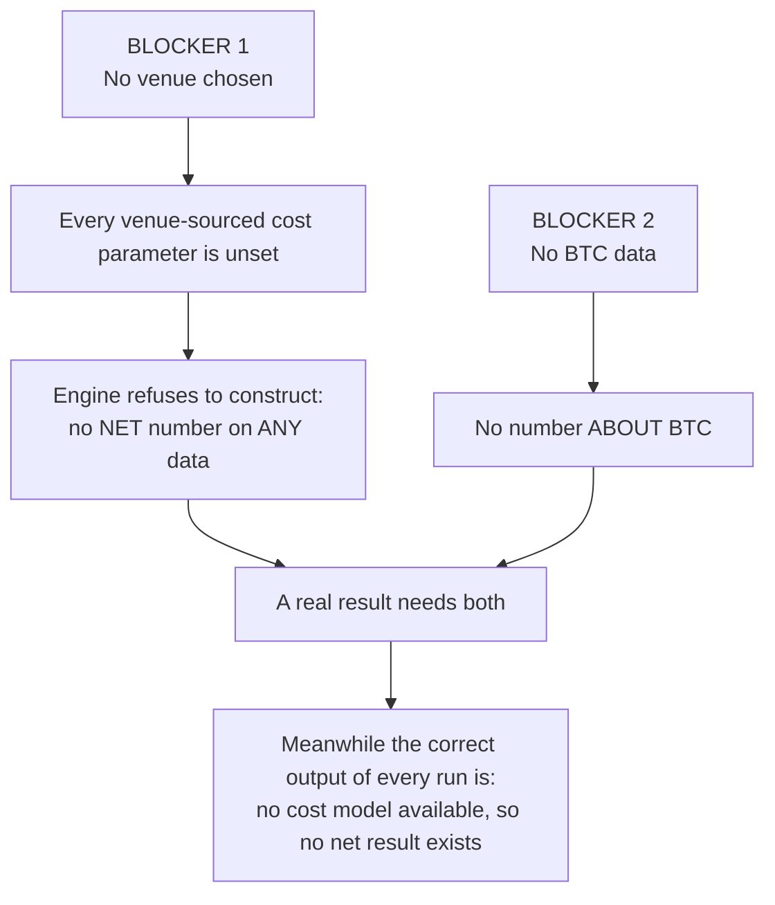
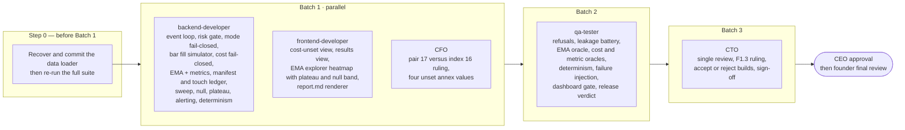

# Status and Roadmap

Measured on **2026-09-20** on a fresh Windows clone, at the commit that introduced this documentation. Nothing here is remembered from earlier sessions; where a claim comes from the handoff instead of a measurement, it says so.

## 1. Component status

| Component | Path | Status | Evidence |
|---|---|---|---|
| Data loader | `src/bitbull/data/` | **BUILT, NOT IN REPO** | Handoff reports 795 lines (`errors`, `schema`, `manifest`, `bar`, `_timestamps`, `loader`, `adjustment`). **Source absent from the clone**; six tests that reference it fail. See §3 |
| Dashboard Round A | `src/bitbull/ui/` | **BUILT** | F1.1–F1.4; 33 tests pass. Handoff reports 438 lines |
| Strategy interface | `src/bitbull/strategy/base.py` | **BUILT** | The `Strategy` ABC. **No EMA computation exists** |
| Fixtures | `tests/fixtures/runs/` | **BUILT** | Three `run.json` (running, completed, cost-refused), `sweep.json`, Parquet series. **Hand-authored and synthetic — not produced by an engine** |
| Backtest engine | `src/bitbull/backtest/` | **SKELETON** | Modules raise `NotImplementedError`; no event loop |
| Risk gate | `src/bitbull/risk/` | **SKELETON** | |
| Fill simulator | `src/bitbull/execution/` | **SKELETON** | |
| Observability | `src/bitbull/obs/` | **SKELETON** | |
| CLI | `src/bitbull/cli/` | **SKELETON** | |
| Dashboard F1.5–F1.7, `report.md` renderer | — | **NOT STARTED** | |
| Sweep, null band, plateau, holdout ledger | — | **NOT STARTED** | |

## 2. Test status (measured)

Baseline on the original single-tree layout, and again after separating the org from the bot, with `PYTHONUTF8=1` on Windows / Python 3.11.15 via `uv`:

| Suite | Command | Passed | Failed | The failures |
|---|---|---|---|---|
| Bot | `cd backtest-bot && uv run --frozen pytest -q` | 55 | 6 | All six need the missing loader: 2 in `test_import_graph.py`, 4 in `test_no_float_money.py` |
| Org tooling | `python -m pytest tests/test_tooling.py -q` | 43 | 8 | Six are the unfinished `msg.py` work per the handoff (4 frontmatter-parsing, 2 message-creation). **Two are a separate defect found while checking:** the boundary audit's `--include-ignored` reports the collapsed directory `backtest-bot/data/` instead of the file inside it (observed output), so the two ignored-path tests fail. Known; expected; **no new failures** |
| Push gate (added later, same day) | `python -m pytest tests/test_push_gate.py -q` | 33 | 0 | — |
| **Total** | | **131** | **14** | The 98 / 14 figure was identical before and after the restructure (**no new red**); the push-gate suite added 33 passing tests |

The handoff reported "148 passed, 8 failed". That does not reproduce from a fresh clone, because the previous check ran in a working tree that still contained the loader and its tests.

Also run and clean: `scripts/spec_lint.py` (7 specs, all citations resolve), `scripts/check_boundaries.py --audit` (32 messages, all in legal rooms), and a render of all three fixture runs to HTML.

## 3. Known issues

| # | Issue | Impact | Action |
|---|---|---|---|
| 1 | **The data loader was never committed.** A bare `data/` rule in `.gitignore` matched `src/bitbull/data/` at any depth; the previous "fresh clone" check used `git ls-files` *plus untracked files*, so it never saw the omission | The engine's foundation is missing from GitHub; 6 tests red | `.gitignore` is fixed (anchored). **Recover the loader and its tests from the original cloud environment** (session "Bitbull Capital agent organization") and commit them. If unrecoverable, rebuild from `backtest-engine-contract-v1` §5 and `bar-ingestion-and-run-fields-v1` §2 with QA review |
| 2 | **8 red tooling tests** (6 `msg.py`, 2 ignored-path listing) | Org tooling defects, not bot defects | CTO finishes the `msg.py` migration and makes the ignored-path audit list files rather than collapsed directories |
| 3 | **`(9, 20)` is "pair #17" in the rules spec but index 16 under lexicographic enumeration** | Decides *which configuration is the founder's baseline of record* | CFO ruling — first item of Batch 1. Fixtures identify the founder's pair by an explicit `is_founders_declared_pair` flag rather than guess |
| 4 | **F1.3 wording** — the pages never contain "fake cash" | Accept-or-send-back on a CFO-owned requirement | CTO decision at review |
| 5 | **Annex or cost-model v2?** Engineering's reading is that the additive annex is correct; the annex itself left the question open to the CTO | Determines versioning | CFO to confirm engineering's reading |
| 6 | **Dashboard field gaps** — no first/last bar timestamp field; `window_label` and `tag` absent from fixtures | Header fields render "(not emitted this run)" | CTO ruling, then backend adds fields |
| 7 | **No CI, linter, type checker or coverage** | Regressions are found late | See [`engineering-standards.md` §4](engineering-standards.md#4-production-readiness-gaps) |

## 4. Blockers that no amount of building clears

Both are **founder decisions**. Neither stops the build; both stop the result.

| Blocker | Options for the founder | Recommendation on record |
|---|---|---|
| **Venue** | Choose one of Topstep, Webull, Coinbase, Polymarket | CEO and CFO both recommend **Coinbase first, Topstep second** (open documented API, free history, 24/7). The founder decides. Polymarket is out of scope for the v1 cost model |
| **Data** | (1) Name a public GitHub repo and path holding BTC 1h OHLCV — transport verified; (2) widen the environment's network policy to a venue or Yahoo; (3) upload a CSV or Parquet | Option 2 is the only one that meets the CFO's point-in-time data bar. A third-party CSV is **not venue data** and may be used for a first run only if labelled *unvalidated third-party* |

A third, softer dependency: the CFO owes four `unset` annex values — `sigma_window_bars`, `sigma_floor_bps`, `bar_participation_cap`, and the spread estimator.

**And one finding the founder must not lose:** one year of 1h data on one instrument cannot produce a statistically significant edge claim (Sharpe standard error about 2.05). See [`methodology.md` §1](methodology.md#1-read-this-first-what-the-evidence-can-and-cannot-show).

## 5. Roadmap — the approved plan

Compiled from `HANDOFF.md` §8. Five dispatches in three batches; paths are disjoint, so batch 1 runs in parallel. **Push after every batch.**

| Batch | Owner | Scope | Builds against |
|---|---|---|---|
| **0** | backend / CTO | Recover the loader; anchor `.gitignore` (done); green CI on a clean clone | — |
| **1a** | `backend-developer` | B1.5–B1.12: event loop · risk gate (shared with paper) · mode fail-closed · bar fill simulator · cost fail-closed · **EMA computation + metrics** · manifest and touch ledger · sweep/null/plateau · alerting · determinism | Engine contract, annex, ingestion spec, rules spec |
| **1b** | `frontend-developer` | F1.5–F1.7: cost-unset state · results view · **EMA explorer with heatmap, plateau region and null band** (the founder's actual ask) · `report.md` renderer with no engine access | Rules spec §9, run-output contract |
| **1c** | `cfo` | Two rulings that gate correctness: the `(9,20)` index; the four `unset` annex values | — |
| **2** | `qa-tester` | P1–P6 in one dispatch, ending in a release verdict | Engine contract §14 |
| **3** | `cto` | Review of everything; F1.3 wording; accept or reject; sign-off | — |
| **4** | CEO → founder | Approval, then final review of the finished system | — |

Binding CFO requirements on the frontend: **no best-returns leaderboard**; the confidence interval as visible as the headline number; synthetic data unmissable; cost-refused is a designed state, not an empty panel.

**What was deliberately compressed, and the risk.** The founder asked for speed and authorized skipping layers: the CTO authoring a work order per build round (safe *only because* the seven specs already state the contracts), separate B and C rounds, and reviews between rounds. **Kept and not negotiable:** QA validation before sign-off, CTO sign-off, founder final review, and every firm rule. If the end review sends work back, the compression cost more than it saved — say so plainly rather than absorbing it.

## 6. Risks

| Risk | Likelihood / effect | Mitigation |
|---|---|---|
| Loader unrecoverable | Rebuild cost; delays the engine | Specs define it precisely; rebuild under QA review |
| Session rate limits kill agents mid-task | Six deaths so far | Tell every agent to save to disk as it goes; **check the disk before re-running anything** |
| Build rounds cost far more than analysis rounds | Backend Round A: 217,213 tokens, 76 tool calls, versus a ~90k analysis baseline | Tight work orders naming 2–3 files; log every dispatch in `workspaces/exec/work/token-ledger.md` |
| Sub-agents cannot dispatch others or call MCP tools | Orchestration overhead | The documented *courier exception* — the CEO session carries work orders; unreviewed output is never ready for the founder |
| A synthetic result mistaken for a real one | Founder decides on fake evidence | Default-deny synthetic overlay; provenance header; `synthetic_fixture` string reaches the screen unchanged |
| A cost-free result | Overstated edge | Engine refuses to construct with any parameter `unset`; gross is never shown without net |
| Overfitting through the dashboard | Founder finds a spike and believes it | Heatmap with null band; no leaderboard; exploratory runs excluded by construction; touch ledger capped at 3 |

## 7. Environment facts that shape the plan

| Fact | Detail |
|---|---|
| Venue egress blocked from the cloud environment | Coinbase, Topstep, Yahoo, Binance, cryptodatadownload all unreachable; `pypi.org` reachable |
| GitHub reachable | A dataset can be fetched once its exact path is known, never discovered (search API blocked) |
| Alpha Vantage connector live but limited | `CRYPTO_INTRADAY` is premium on this key; daily crypto endpoints are free |
| `yfinance` installs but is useless | Its data host is blocked |

These describe the cloud environment the org ran in. A local machine may not share them — but no dataset path has been named either way.
