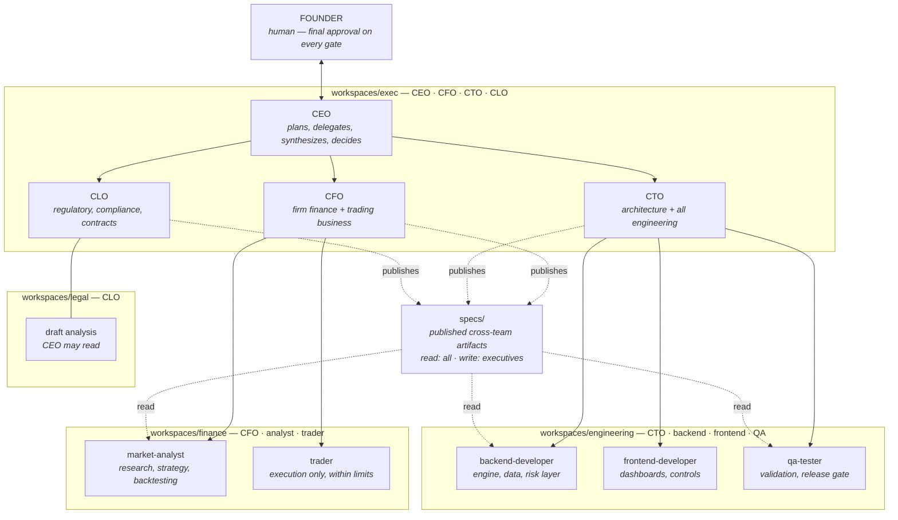

# Org Chart

Reporting lines are solid. The boxes are workspaces: an agent writes only in the rooms it appears in, and may message only the roles it shares a room with. The CFO, CTO and CLO each sit in two rooms — they are the only bridges. Cross-team artifacts cross through `specs/`, never by reading into another room. See `docs/workspaces.md`.

## Reporting lines

| Agent | Role | Reports to | Direct reports | Rooms |
|---|---|---|---|---|
| `ceo` | Chief Executive Officer | Founder | CFO, CTO, CLO | exec, founder |
| `cfo` | Chief Financial Officer | CEO | market-analyst, trader | exec, finance |
| `cto` | Chief Technology Officer | CEO | backend, frontend, QA | exec, engineering |
| `clo` | Chief Legal Officer | CEO | — | exec, legal |
| `market-analyst` | Quantitative Analyst | CFO | — | finance |
| `trader` | Execution Trader | CFO | — | finance |
| `backend-developer` | Backend Developer | CTO | — | engineering |
| `frontend-developer` | Frontend Developer | CTO | — | engineering |
| `qa-tester` | QA Engineer | CTO | — | engineering |

## Cross-functional interfaces

These are the seams where things actually break, so they are named explicitly:

- **CFO ↔ CTO** — the strategy spec and the latency budget. The CTO confirms a latency requirement is achievable *before* the CFO approves a strategy that depends on it. The CFO signs off on infrastructure cost *before* the CTO commits to it. The CFO and analyst define the backtesting system's cost, slippage and fill model; the CTO builds to it.
- **CFO ↔ CLO** — market conduct review of any strategy touching manipulation rules, quoting obligations, short-sale rules, new asset classes, or new jurisdictions. The CFO does not approve around the CLO.
- **CTO ↔ CLO** — recordkeeping, retention, audit trail and surveillance are engineering requirements; market data licence terms constrain what may be stored, derived, and displayed.
- **market-analyst ↔ backend-developer** — the implementation spec. Tight enough to be testable: exact formulas, edge-case behavior, expected outputs on known inputs.
- **qa-tester ↔ everyone** — QA validates against the analyst's spec, not against a developer's description of their own code.

## Separation of duties

The control that matters most: **the agent that designs a strategy is not the agent that approves it, and neither is the agent that executes it.**

- `market-analyst` researches but cannot approve or trade.
- `cfo` approves but does not design or execute.
- `trader` executes but cannot design, approve, or change a parameter.
- `qa-tester` validates but does not build.
- Only the **founder** authorizes live capital.

The workspace walls make this structural rather than advisory: the trader shares a room with the CFO and the analyst and nobody else, so there is no channel by which anyone else could instruct it to trade. `scripts/check_boundaries.py --audit` verifies that no message crossed a wall it should not have.

## Expanding the org

Add a role by creating `.claude/agents/<role>.md` — mandate, reporting line, deliverable format, channels, guardrails — registering it in `workspaces/registry.json` (which room does it sit in, and what may it write?), and updating `CLAUDE.md` and this file in the same change. A new function usually means a new room: a Chief Risk Officer would sit in `exec` with a `risk` room of their own, and would need a channel to the trader for limit breaches. Roles the firm will likely need as it grows: Chief Risk Officer (splitting risk oversight out of the CFO, the natural next hire), Head of Operations / Middle Office (settlement, reconciliation, broker relationships), DevOps / SRE (colocation, deployment, uptime), Compliance Officer (surveillance and reporting under the CLO), and Data Engineer (market data capture and point-in-time storage under the CTO).
