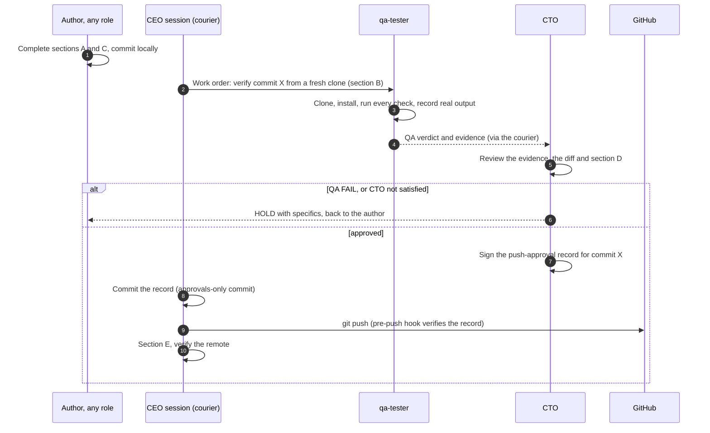

# Push Checklist — before anything goes to GitHub

**Applies to every push, of any size, to any branch, including documentation-only pushes.**
**Rule (founder, 2026-09-20):** no push is made without the CTO's written approval, and the CTO approves only after confirming the result with the tester (`qa-tester`). This checklist is what is checked; the approval record is the proof; the pre-push hook is the tripwire. It is part of the deployment checklist — see [`governance/approval-policy.md`](../approval-policy.md) gate 5 and [`docs/org/workflows/build-and-release.md`](../../docs/org/workflows/build-and-release.md).

Why it exists: a single push once shipped without the data loader because a `.gitignore` rule hid it, and the check that should have caught it ran in the author's own working tree. Tests that pass where the code was written prove very little about what is actually in the repository. That is why step B insists on a **fresh clone**.

## Who does what



The CEO session is transport only, exactly as in the courier exception. **It does not sign for QA or the CTO, and it does not approve its own pushes.** The author of a change is never the one who verifies or approves it.

## A. Before asking QA — the author (every item, no exceptions)

**Scope and hygiene**
- [ ] `git status` reviewed: every changed file is intended. Nothing unrelated is staged.
- [ ] On the intended branch. **No force-push, no `--no-verify`, ever.**
- [ ] **No secrets** in the diff: keys, tokens, credentials, account numbers, `.env` contents. `git diff --cached` read, not skimmed. (Firm rule 5.)
- [ ] No build junk staged: `.venv/`, `__pycache__/`, `*.pyc`, `.pytest_cache/`, scratch output, market-data snapshots.
- [ ] **Nothing important is hidden by `.gitignore`.** Run `git status --ignored` and read what is ignored under `backtest-bot/src/`, `backtest-bot/tests/`, `scripts/`, `governance/`, `docs/`. A source or test file appearing there is a defect (this is how the data loader went missing).
- [ ] New directories and files are **tracked** — `git ls-files <new path>` prints them.

**Documentation that must be updated when the thing it describes changed** (tick "n/a" only with a reason)
- [ ] `HANDOFF.md` — current state (§6), test counts, blockers, next steps, environment facts. No stale commit hashes.
- [ ] `CLAUDE.md` — if the layout, a standing rule, or the state of the firm changed.
- [ ] `docs/backtest-bot/` — architecture, data flow, contracts, dashboard, status and roadmap, whichever the change touches. **Status markers (BUILT / SKELETON / NOT STARTED) must match the code.**
- [ ] `docs/org/` — org chart, roles, workspaces, gates, workflows, if the org changed.
- [ ] `specs/` — **never edited in place.** A change is a new versioned file plus a `SUPERSEDED BY` line on the old one. `specs/README.md` index updated if a spec was added.
- [ ] `governance/decision-log.md` — an entry for any decision that commits money, is hard to reverse, or a successor would need the reasoning for.
- [ ] `workspaces/registry.json`, `.claude/agents/*.md`, `docs/org/org-chart.md` — updated **together** if a role, room or write scope changed.
- [ ] `workspaces/exec/work/token-ledger.md` — every sub-agent dispatch in this round logged, with the dispatcher-measured token figure.
- [ ] Every number in any doc is **measured, sourced, or labelled an estimate** (firm rule 1). No test counts, line counts or percentages from memory.
- [ ] Links resolve; Mermaid diagrams are syntactically valid.

**Firm rules** (any "no" blocks the push)
- [ ] Nothing here can reach a venue, hold a credential, or place an order. Paper by default; an unset mode resolves to paper.
- [ ] No venue specifics (fees, limits, APIs, terms) stated from memory — read from current documentation and cited, or labelled *unverified*.
- [ ] No agent signed for a role that did not sign. Approval records contain only their own signer's lines.
- [ ] Anything that could place a live order has the full production-deployment chain (QA → CTO → CEO → **founder**) — this checklist does not replace it.

## B. QA verification — `qa-tester`, from a FRESH CLONE

The tester works from a clean copy of the **committed** commit, never from the author's working tree — a working tree contains ignored, untracked and stale files that a real clone does not.

```bash
git clone --no-hardlinks <path-or-url> /tmp/verify && cd /tmp/verify
git checkout <commit X>                       # the exact commit under review
git rev-parse HEAD                            # record it in the verdict
```

- [ ] **Clone is clean and complete**: `git status --short` empty; files the change claims to add are present.
- [ ] **Bot suite**, in a clean environment: `cd backtest-bot && uv sync --frozen && uv run --frozen pytest -q`. Record passed / failed counts and every failing test name.
- [ ] **Org tooling suite** from the repo root: `python -m pytest tests/test_tooling.py tests/test_push_gate.py -q` (`PYTHONUTF8=1` on Windows).
- [ ] **No new red.** Compare against the known set below. Any failure not on it is a **blocker**.
- [ ] `python scripts/spec_lint.py` — PASS.
- [ ] `python scripts/check_boundaries.py --audit` — PASS.
- [ ] **Boundary check for the author's role** over the diff: `python scripts/check_boundaries.py --role <author> <paths…>`. Violations must be explained in the record (a founder-directed exception is legitimate; a silent one is not).
- [ ] If `backtest-bot/src/bitbull/ui/` or fixtures changed: `python -m bitbull.ui.dash_cli tests/fixtures/runs <tmp>` renders every fixture run.
- [ ] Doc links resolve and each `mermaid` fence is balanced (a link/anchor check over `docs/`, `README.md`, `HANDOFF.md`, `CLAUDE.md`).
- [ ] The documentation claims in section A match what QA observed (test counts, status markers, paths). **A doc that states a number QA cannot reproduce is a defect.**
- [ ] Risk-critical paths untouched, or covered: anything in `risk/`, `execution/`, mode handling, or the approval machinery gets extra scrutiny and is named in the verdict.

**Known failing set** (update this list in the same change that changes it; QA compares against the list *in the commit under review*):

| Suite | Known failures | Cause |
|---|---|---|
| Bot | 6 — `test_import_graph` (2), `test_no_float_money` (4) | The data loader was never committed. **Removed from this list the moment the loader lands** |
| Org tooling | 8 — `TestS3FrontmatterParsing` (4), `TestGitignoredPaths` (2: `include_ignored_*`), `TestExistingBehaviourPreserved` (2) | Unfinished `msg.py` migration (6); ignored-path audit lists a collapsed directory (2) |
| Push gate | 0 — all 51 tests in `tests/test_push_gate.py` must pass | — |

**Verdict** — one of: `PASS`, `PASS WITH NOTED RISK` (each risk named), `FAIL`, or `COULD NOT VERIFY` (say which check could not be run and why). Pressure and deadlines do not change the verdict; only evidence does. No `PASS` with an open blocker, a failing test outside the known set, or a check that was not executed.

## C. Commit quality — the author

- [ ] Message states **what and why**, and any test result quoted was actually measured.
- [ ] Trailers present: `Co-Authored-By:` and the session link where required by the session's attribution rules.
- [ ] One logical change per commit where practical; no unrelated churn.

## D. CTO review — before signing

The CTO does not rubber-stamp the QA verdict. They:

- [ ] Read QA's **evidence** (commands and real output), not only the verdict line.
- [ ] Read the diff at the level the risk warrants — everything in `risk/`, `execution/`, `scripts/`, `.githooks/`, `registry.json` and approval machinery in full.
- [ ] Check section A was honestly completed, in particular the ignored-files and fresh-clone items.
- [ ] Confirm the branch and remote are the intended ones, and that the push is **not** a force-push or a deletion.
- [ ] Confirm nothing in the push needs a higher gate (CEO/founder) that has not been given.
- [ ] Decide: **APPROVED**, or **HELD** with specifics sent back to the author. A hold is the process working, not a failure.

## E. The push and after

- [ ] The approval record is committed, and names the exact commit being approved (`approved_commit`). Only `governance/approvals/**` may change between that commit and the tip.
- [ ] The pre-push hook is installed (`git config core.hooksPath .githooks`) and was **not** bypassed.
- [ ] Push **only** the approved commit to the approved branch.
- [ ] Afterwards: `git ls-remote origin <branch>` equals the local tip. Report the resulting SHA — **an unverified push is not reported as done.**
- [ ] If the push was refused or hung: report exactly that. Do not route around it with another tool.

## Changing this checklist

This file is a **policy** (CEO, CFO, CLO may write `governance/policies/**`), and a change to it goes through the gate like any other push. The CTO owns enforcing it; the CEO owns its wording. Add an item whenever a defect escapes that a check would have caught — the data loader item in section A is the model.
